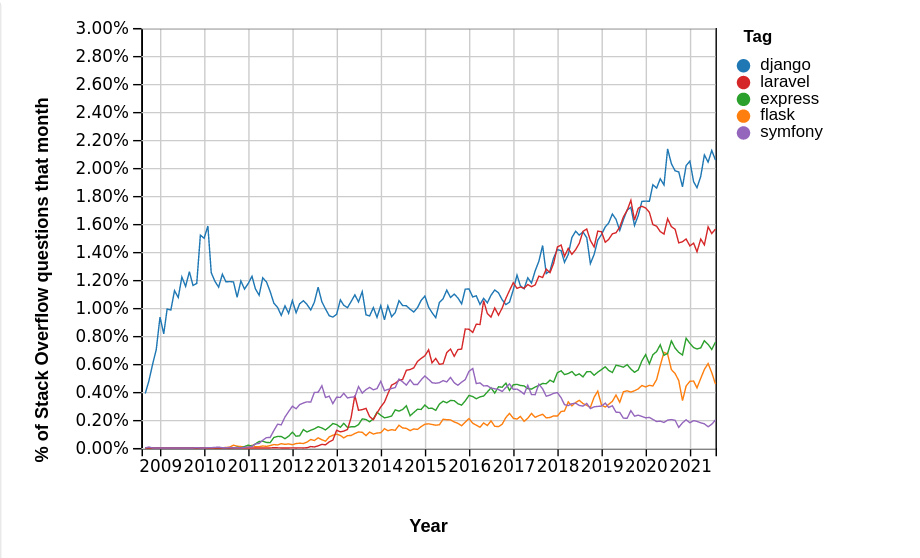

# Django Initiation

par

Julien Palard <julien@palard.fr>

https://mdk.fr

::: notes

Introduce yourself!


# Django

Django est une infrastructure d'applications web populaire et robuste.

> The web framework for perfectionists with deadlines.


## Django : qui l'utilise ?

- Instagram, Pineterest, Mozilla, Disqus, BitBucket, …




## Vocabulaire

Dans Django on va avoir principalement des `models`, des `vues`, des
`templates`, et des `urls`.


# Les bonnes bases

On travaillera toujours dans un `venv` :

```python
python -m pip install django
```

# La théorie — Projet

Pour démarrer un projet, une commande :

```python
django-admin startproject project
```

## La théorie — App

Une fois dans le projet, pour créer une application, une commande :

```python
python manage.py startapp watch
```

::: notes

(et ajout dans `settings.py`)


## La théorie — Modèle

Un « modèle » est la description d'une table.

Ça rappelle un ORM, mais ça permet beaucoup plus de choses en Django.

::: notes

- admin
- forms
- serializers (API)
- class based views


## La théorie — Modèle

Par exemple :

```python
class Website(models.Model):
    host = models.CharField(max_length=512)
    is_up = models.BooleanField(null=True, blank=True)
    last_check = models.DateTimeField(auto_now_add=True)
```

::: notes

Prendre le temps d'expliquer les fields (leur relation avec la DB), et
les differents endroits ou Django peut reutiliser cette information
(widgets, validation, ...).


## Première interface d'admin

En une ligne, pourquoi pas :

```python
admin.site.register(Website)
```

## La théorie — la DB

- PostgreSQL
- MySQL
- sqlite
- ...

::: notes

Leur faire croire 2 secondes qu'on va devoir s'installer et se
configurer un serveur de base de donnée :D


## La théorie — La DB

```bash
python manage.py makemigrations
python manage.py migrate
```

::: notes

On expliquera plus tard, leur dire que ça crée la DB et que le but
maintenant c'est surtout d'aller tester ça :)


## L'interface d'administration

On a une DB, mais pas encore d'utilisateur admin dedans :

```bash
python manage.py createsuperuser
```

## Terminé

On a terminé, on peut démarrer le serveur :

```bash
python manage.py runserver
```

# La pratique

```bash
django-admin startproject project
cd project
python manage.py startapp watch
```

::: notes

Biiien prendre le temps d'expliquer l'arborescence, de se promener,
d'y lire les commentaires.


## La pratique

Ajout de l'app `watch` dans `project/settings.py` :

```python
INSTALLED_APPS = [
    "watch",
    ...,
    ...,
]
```


## Les modèles

On va mettre celui-ci dans `watch/models.py`.

```python
class Website(models.Model):
    host = models.CharField(max_length=512)
    is_up = models.BooleanField(null=True, blank=True)
    last_check = models.DateTimeField(auto_now_add=True)
```


## Première interface d'admin

Et ça dans `watch/admin.py`.

```python
from watch.models import Website


admin.site.register(Website)
```


## Création de la DB

```bash
python manage.py makemigrations
python manage.py migrate
```

::: notes

Expliquer les deux étapes.


## Les modèles

Désambiguons `makemigrations` et `migrate` d'abord.


## L'interface d'administration

On a une DB, mais pas encore d'utilisateur admin dedans :

```bash
python manage.py createsuperuser
```

## Terminé

On a terminé, on peut essayer maintenant ?

```bash
python manage.py runserver
```
::: notes

Leur faire faire ça dans un **autre** shell.

puis les laisser jouer avec l'interface d'admin, créer quelques sites...


## L'interface d'administration

Les modèles, leurs `fields` ne servent donc pas qu'a l'ORM, cette
interface d'admin nous à demandé une ligne de code.

::: notes

Si ce n'est pas déjà fait, leur faire ajouter des `__str__`.


## Astuce

On peut passer beaucoup de temps à peaufiner l'interface d'admin,
repoussez ça après avoir livré une première version.


# Manipulation des modèles

## Mise en pratique

Créez le modèle `Check` avec les champs `is_up`, `date`, `website`, et
`message`.

::: notes

Pour le champ `website` vous aurez besoin d'un `models.ForeignKey`, RTFM.


## L'admin

Ajoutez une interface d'admin pour ce modèle, et ajoutez à la main quelques « *checks* ».

::: notes

Les faire tester ça.


## Personalisons

Dans chaque modèle, un `__str__` aide l'admin à être lisible.


## Personalisons

Dans `admin.py` on peut préciser les colonnes qu'on veut afficher :

```python
@admin.register(Website)
class WebsiteAdmin(admin.ModelAdmin):
    list_display = ("host", "is_up", "last_check")


@admin.register(Check)
class CheckAdmin(admin.ModelAdmin):
    list_display = ("website", "date", "is_up", "message")
```


# Les URLs & les vues

Changons complètement de sujet : les URLs et des vues.


## Les URLs

Dans `project/urls.py` on va se rajouter une URL pour la page d'accueil :

```python
from watch import views

urlpatterns = [
   ...
   ...
   path("", views.index, name="index"),
]
```

::: notes

C'est un `path`, un chemin, c'est le chemin vide.


## Les URLs

On aurait pu rajouter :

```python
path("about", views.about, name="about"),
path("help", views.help, name="help"),
...
```

## include

Petite parenthèse, on aurait pu mettre un `urlpatterns` dans
`watch/urls.py`, et les inclure dans `project/urls.py` en utilisant :

```python
from django.urls import include

[...]

path("", include("watch.urls")),
```

::: notes

C'est pratique pour « ancrer » un ensemble de chemin sous un autre
chemin : pour se faire une hierarchie.


## namespaces

Les espaces de nommage permettent de désambiguer les urls nommées :

`index` est le nom de la page d'accueil de l'interface d'admin de la
page d'accueil de votre application...


## namespaces

Avec les espaces de nommage, on a donc :

- `admin:index`
- `watch:index`

sans ambiguité.

::: notes

Utiliez-en, c'est bien.


## Les vues

Dans `watch/views.py` :

```python
from django.http import HttpResponse
from django.shortcuts import render


def index(request):
    html = "<html><body><h1>Website Watcher</h1></body></html>"
    return HttpResponse(html)
```


::: notes

C'est bien mais écrire du HTML dans du Python c'est pas élégant.


## Les vues

Mieux :

```python
from django.http import HttpResponse

def index(request):
    return render(request, "watch/index.html")
```


## Les templates

Django va chercher `watch/index.html` dans tous les dossiers de
templates, dont `watch/templates/`.


## Les templates

Donc dans `watch/templates/watch/index.html` :

```html
<!DOCTYPE html>
<html lang="fr">
<head>
    <meta charset="utf-8" />
    <title>Website Watch</title>
</head>
<body>
    <h1>Website Watch</h1>
</body>
</html>
```

::: notes

La création du dossier `templates/` est typiquement quelque chose que
`runserver` ne voit pas, il faut le redémarrer.


## Les vues

Et si on ajoutais de la données provenant de la DB dans le template ?


## Les vues

```python
...
from watch.models import Website

def index(request):
    return render(request, "watch/index.html",
                  {"websites": Website.objects.all()})
```

::: notes

Ne pas oublier les imports…

Premier apperçu de l'ORM en passant.


## Les vues

Digression :

Il existe aussi des vues basées sur des classes, pouvant s'appuyer sur
des modèles.


## Les vues

```python
class WebsiteListView(ListView):
    model = Website
```

## Les templates

```html
<body>
    <h1>Website Watch</h1>
    <ul>
    
        <li>{{ website.host }} ✓✗</li>
    
    </ul>
</body>
```


## Les templates

Ça fonctionne, mais on ne veux pas répéter l'entête HTML à chaque
page…


## Les templates

En utilisant `extends`, on peut réutiliser des templates.


## La Debug Toolbar


## La Debug Toolbar

```bash
python -m pip install django-debug-toolbar
```

L'ajouter dans `settings.py` et `urls.py`.


# L'ORM

## L'ORM

C'est l'occasion de sortir un `python manage.py shell`.

```pycon
>>> from watch.models import Website
>>> Website.objects.all()
```

Essayer `.all`, `.filter`, `.get`, `.order_by`, et les slices.


## Les *Managers*

Les *managers* représentent une table, il sont accessible via
l'attribut `objects` d'un modèle.

Ses opérations (des méthodes) renvoient des `queryset`s.

```pycon
In [2]: Website.objects
Out[2]: <django.db.models.manager.Manager at 0x7fa77a9a1500>
```


## Les instances de modèles

Les instances de modèles représentent une ligne de la table.


## Les *Queryset*

Représentent un ensemble de lignes de la base de donnée. Ils ont les
mêmes méthodes que les *managers* :

- filter
- get
- order_by
- ...


## Les *Queryset*

```pycon
In [3]: Website.objects.all()
Out[3]: <QuerySet [<Website: mdk.fr>]>
```


## Les *Queryset*

Pour ceux qui ont fait du SQL c'est un "lazy select" : c'est un
`SELECT` qui ne s'éxécutera que si nécessaire.


## Les *RelatedManager*

Sont des managers, mais sur les relations :

```
In [4]: Website.objects.get(host="mdk.fr").check_set.all()
Out[4]: <QuerySet [<Check: mdk.fr is up>, <Check: mdk.fr is up>]>
```


# Forms

Comme pour l'admin, Django peut utiliser les informations des modèles
pour vous aider à générer des formulaires.


## Forms fields

Créer un formulaire ressemble à créer un modèle, on décrit les champs :

```python
class WebsiteForm(forms.Form):
    host = forms.CharField(label='Website hostname', max_length=512)
```


## Forms

On le donne au template :

```python
    return render(
        request,
        "watch/index.html",
        {"websites": Website.objects.all(), "form": WebsiteForm},
    )
```


## Forms

On l'affiche dans le template :

```html
<form action="/" method="post">
  
  {{ form }}
  <input type="submit" value="Add">
</form>
```

## Forms

Mais là on a pas utilisé les informations données par les modèles…


## ModelForm

Avec un `ModelForm` on ne répète pas les fields :

```python
class WebsiteForm(forms.ModelForm):
    class Meta:
        model = Website
        fields = ("host",)
```


## Widgets

Le rendu HTML d'un champ de formulaire est appelé un `Widget`, il est
possible de le changer, par exemple si vous préférez un `<input` à un
`<textarea` ou vice-versa.


## Validation

Une instance de formulaire à une méthode `is_valid` :

```python
if request.method == "POST":
    form = WebsiteForm(request.POST)
    if form.is_valid():
        Website.objects.create(host=form.cleaned_data["host"])
```

::: notes

Django peut donc vérifier que les champs non-empty sont bien pas
vides, que les longuers sont respectées, etc…


# Les tests

Tester c'est douter.

::: notes

Ou pas. Avoir les tests qui passent avant de pousser, avant de merger
une PR, avant de mettre en prod c'est un véritable confort.


## Les fixtures

Pour tester on va avoir besoin de données de test.

On appelera ça des « fixtures ».


## Les fixtures

Le moyen simple de créer des fixtures est d'utiliser les données que
vous avez crées via l'admin :

```bash
./manage.py dumpdata -o watch/fixtures/initial.json
```

::: notes

Créez le dossier d'abord ;)


## Les fixtures

Profitez-en pour indiquer aux collègues dans le README qu'ils peuvent les charger aussi :

```bash
git clone …
cd project
./manage.py migrate
./manage.py loaddata initial
```


# Les relations entres modèles

On a déjà fait une `Foreignkey`, mais il existe aussi :

- OneToOneField
- ManyToManyField


::: notes

Parler des cas d'usage, et parler de `thrue`.


# Users
## Groups
## Permissions
## Authentication

# Static assets

Chaque application peut déposer des fichiers dans son dossier `/static/`.


## Static assets

En dev ils seront tous accessibles via l'URL `/static/`.


## Static assets

En prod cependant il y a beaucoup plus efficace pour les servir :

```bash
./manage.py collectstatic
```

Puis configurez votre serveur HTTP (`nginx`/`apache2`) pour servir le
dossier généré sans passer par Python.


# Deployment

En parlant de prod, comment mettre un Django en prod ?


## Deployment

Django utilise le protocole `wsgi`, un standard en Python.


## Deployment

Attention, `runserver` c'est bien en dev, mais ça n'est pas voué à partir en prod.

::: notes

Sérieusement.


## Deployment

`runserver` c'est un peu comme un groupe éléctrogène :

- C'est vrai que ça fonctionne.
- Ça dépanne quand on est seul dessus, chez soi.
- Mais on alimente pas un quartier ou une ville avec.

::: notes

Trouver mieux :D


## Deployment

Nginx et Apache2 gèrent `wsgi`, d'autres serveurs aussi, probablement.


## Deployment

Mais en production on ne veut pas juste une instance de Django, on en
veut plusieurs, pour traiter plus de requêtes, pour ça on peut
utiliser `gunicorn`, `uwsgi`, …


## Deployment

`gunicorn` est un bon point de départ :

```bash
pip install gunicorn
gunicorn -w 16 project.wsgi
```

## Deployment

`gunicorn` est bien derrière un `nginx` qui va s'occuper, entre autre,
de la décapsulation HTTPS, ou de délivrer vos fichiers statiques sans
passer par Python.


## Deployment

```nginx
server {
    listen 443 http2 ssl;
    server_name example.com;

    include snippets/letsencrypt-example.com.conf;

    location /static {
        alias /opt/example.com/static/;
    }

    location / {
        proxy_pass http://unix:/run/example.com/wsgi.sock;
        proxy_set_header Host $host;
        proxy_set_header X-Forwarded-Protocol $scheme;
    }
}
```


# Bonnes pratiques

Pas de `order_by` / `fiter` / ... dans les vues, rangez ça dans les
modèles (dans des *managers* personalisés).

Ça permet de nommer et de réutiliser.


## Bonnes pratiques

La gestion des dépendances avec `pip-compile`.


## Bonnes pratiques

Versionnez !!


## Bonnes pratiques

Prennez le temps de poser un `.gitignore`.


## Bonnes pratiques

On en mettra le moins possible dans le dossier du projet, on
utilisera des applications pour le reste du code.


## Bonnes pratiques

On surcharge l'objet `User`, même si on pense ne pas en avoir besoin :

```python
class User(django.contrib.auth.models.AbstractUser):
    ...
```

et :

```python
AUTH_USER_MODEL = ...
```


## Resources

Pour Django on avait : https://ccbv.co.uk/ (Memo: « Classy Class-Based-View »).


# La configuration de Django

- `include local_settings.py`
- `django-configurations`
- `django-environ`
