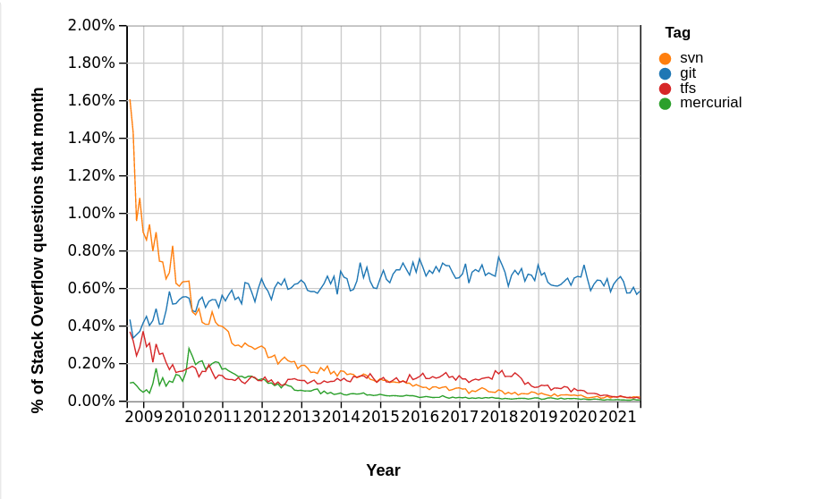

# Initiation Git

par

Julien Palard <julien@palard.fr>

https://mdk.fr

::: notes

Introduce yourself!


# Git

Git est un gestionnaire de code source distribué.


## Git : qui l'utilise ?

- Le kernel Linux
- Google, Microsoft, Facebook, Netflix, ...
- PostgreSQL
- Python, perl, Go, swift, typescript, rust, Julia, scala, ...
- ...


## Git : qui l'utilise ?




::: notes

Où plutôt qui ne l'utilise pas encore ?

https://insights.stackoverflow.com/trends?tags=git%2Csvn%2Cmercurial%2Ctfs


## Historique et alternatives

- SCCS (1972) (un fichier, local)
- RCS (1982) (un fichier, local)
- CVS (1986) (projet, client-server)
- Subversion (2000)
- BitKeeper (2000)
- Bazaar (2005)
- Mercurial (2005)
- git (2005)
- Fossil (2007)

::: notes

Et bien d'autres !


## Git est décentralisé

Il n'y a ni serveur, ni client : tout le monde est « au même niveau » :

- On peut travailler seul sur sa machine sur son projet.
- On peut travailler une journée sans connexion à internet.


::: notes

Désambiguer git vs github. J'aime l'analogie : « Git est a Github ce
qu'une photo est a Dropbox ».


# Introduction

Commençons par imaginer un projet : l'écriture d'un livre.


## Introduction

Dans notre projet, `git` va nous simplifier deux choses :

- La collaboration.
- La journalisation des changements (qui a écrit quoi, quand, pourquoi).


## Collaborer

Sans git :

> Moi je modifie le fichier les jours pairs et toi les jours impairs.

Sinon quand on sauvegarde on écrase les modifications de l'autre !

::: notes

Imaginons deux auteurs qui travaillent sur un livre, partagé via
Dropbox dans un format propriétaire binaire...


## Conserver l'historique

Sans git, très vite on se retrouve avec :

- mybook.tex
- mybook-2.tex
- Copy of mybook-2.tex
- mybook-2-alternative-end.tex
- mybook-2-alternative-end-old.tex
- mybook-final.tex
- mybook-final-1.tex
- mybook-final-final.tex
- mybook-final-preprint.tex
- mybook-final-preprint-corrected.tex
- mybook-final-preprint-corrected-final.tex


## Conserver l'historique

> Pourtant hier soir, quand je suis parti, ça marchait…

ou :

> Mais que fait ce code ? Pourquoi il est là ? Qui l'a écrit ? Pourquoi ?

::: notes

Leur montrer le premier commit de Python par exemple (dédramatiser sur
la ligne de commande).


## Conserver l'historique

On peut même demander à `git` de nous trouver automatiquement quelle
modification à introduit un bug.

::: notes

À condition de pouvoir lui dire :

- Comment reproduire le bug
- Quelle version est connue pour fonctionner.
- Quelle version est connue pour ne plus fonctionner.


## Introduction

Comment, sans `git`, pourraît-on résoudre ces deux problèmes ?


## Analogie


## Analogie

En prenant une photo du projet (entier) à chaque modification.

Au dos de la photo on pourrait même rajouter des meta-données :

- Nom de celui qui a fait la photo.
- Date à laquelle la photo à été prise.
- Pourquoi on a pris la photo à ce moment là.
- Et pourquoi pas une signature !


::: notes

Le projet c'est par exemple l'assemblage d'un moteur de fusée...

Attention pas de "zoom sur une morceau", on prend toujours l'objet entier.


## Analogie

Est-ce que ces photos résolvent nos problèmes ?


## Analogie

Pour conserver l'historique, oui, c'est gagné !

::: notes

On aura même un gros carton de photos avec à chaque fois qui à fait
quoi, quand, pourquoi, c'est parfait 50 ans plus tard pour faire de
l'archeologie.


## Analogie

Pour collaborer on va devoir s'envoyer les photos par pigeon voyageur.

- À chaque fois que je reçois une photo, j'applique la modification à ma version.
- À chaque fois que j'ai terminé une étape, j'envoie une photo de ma progression.


## Analogie

Parfois deux photos vont se contredire, par exemple :

- Un collègue à essayé de nouveaux injecteurs en cuivre.
- Vous avez essayé de nouveaux injecteurs imprimés en 3D.

::: notes

Ça s'appelle un `conflit`, et ce n'est pas grave, ça se résoud, mais
pas toujours automatiquement : il faut parfois qu'un humain choisisse
ce qu'il considère être le mieux.


## Analogie

Je vais devoir prendre une décision :

- Prendre ma version.
- Prendre sa version.
- Prendre un peu des deux.


## Analogie

Le résultat sera un nouvel état, encore plus avancé du projet, vite,
je le photographie, je commente au dos de la photo les raisons de ce
choix, et je l'envoie au collègue.

::: notes

Ça s'appelle un `merge`.


## Analogie

Mais souvent les séries de photos ne vont pas se contredire : chacun travaille sur sa partie.

::: notes

Par exemple vous recevez 42 photos d'un collègue qui a passé une
semaine à travailler sur la turbopompe, il était seul à travailler
dessus, vous appliquez son travail sans conflit.


## Analogie

Catastrophe, une pile de photo est tombée, et personne ne sait comment
remettre ça dans l'ordre.

Qu'aurai-on pu faire pour ne pas que ça arrive ?


## Analogie

Au dos de chaque photo on écrit un identifiant **unique**.

Au dos de chaque photo on écrit aussi l'identifiant de la photo précédente !


## Analogie

Notez qu'une photo peut ne pas avoir de photo précédente.

C'est la première photo.


## Analogie

Notez qu'une photo peut avoir deux photos précédentes, c'est la photo faite après la résolution d'une contradiction :

- Une des deux précédentes vient de **ma** pile.
- L'autre vient de **sa** pile.


## Analogie

Notez enfin que l'identifiant d'une photo peut aisément être utilisé **plusieurs fois** :

- Soit pour faire plusieurs tests différents à partir d'un même état.
- Soit lorsqu'un collègue se met à travailler sans pour autant que je m'arrête.


# Avec git

« Prendre une photo » c'est <br/> « faire un `commit` ».

Dans un jeu vidéo ce serait « Sauvegarder ».

Abusez-en.

::: notes

En français c'est parfois traduit « valider ».

## Avec git

Ce qui est commit ne peut pas être perdu¹.

<br/><br/>

<small>¹: Sauf si votre machine brûle.</small>


## Avec git

Envoyer un carton de photos c'est « un `push` ».

## Avec git


## Avec git

Récupérer un carton de photos c'est « un `fetch` ».

## Avec git

Une contradiction entre deux séries de photos c'est « un `conflit` ».

## Avec git

La photo de résolution d'un conflit c'est « un `merge` ».

## Avec git

Comme avec une photo on peut aussi choisir ce qui sera dans le cadre, ça
s'appelle le « staging area », la scène dans notre analogie.


## Avec git

Typiquement on ne va pas photographier nos outils, la servante, ...

Ils ne font pas vraiment partie du projet : on les pousse hors champ à
chaque photo.

(C'est le `.gitignore`.)

::: notes

De toutes façons, sur un même projet, on utilise pas tous les mêmes outils.

## Avec git

Mais typiquement on va ajouter à la photo chaque nouvelle pièce, dès
sa réception, même si elle n'est pas encore bien branchée.

(C'est un `git add`.)


## Avec git

Comme avec nos photos, chaque `commit` permet de connaitre l'état
**complet** du projet au moment où il à été fait.

::: notes

Insister sur le fait qu'il n'est **pas** nécessaire d'avoir les
commits précédents.


# Petite parenthèse CLI

`git` n'est pas graphique : il nous faut un bon terminal et un bon
shell.

## Le terminal

Tout émulateur de terminal sur MacOS et Linux fera l'affaire.

::: notes

Oui c'est un abus de langage mais je ne vais pas dire "émulateur de
terminal" à chaque fois.


## Le terminal

Sur Windows :

- Oubliez `cmd.exe`, ça n'est plus maintenu depuis plus de 10 ans.
- `PowerShell` : sa syntaxe n'est pas standard, mais ça fonctionne.
- WSL : Ça vous ouvrira d'autres portes intéressantes.
- git-for-windows : L'émulateur de terminal est correct, et ça vous apporte bash.


## Le shell

Tout bon shell (bash, zsh, fish, tcsh, ...) fera l'affaire.

Les caractéristiques d'un bon shell, pour moi, c'est :

- De bons raccourcis clavier.
- Une bonne auto-complétion.

::: notes

Une démo s'impose, au moins Ctrl-e, Ctrl-a, Ctrl-k, Ctrl-y.


## Le shell

Les commandes indispensables :

- `git` : pour versionner ses projets.
- `ls` : pour `list` directory entries.
- `cd` : pour `change directory`.

::: notes

Dans l'ordre dans lequel je les utilise le plus souvent, #truestory.

Une démo s'impose.


## Le shell

Les commandes utiles :

- `rm` : pour supprimer.
- `mv` : pour renommer ou déplacer.
- `mkdir` : pour créer un dossier.
- `man` : pour lire le manuel.

::: notes

Une démo s'impose.


# Installation de git

Utilisez votre gestionnaire de paquets habituel :

```text
apt install git  # sur Debian
dnf install git  # sur Fedora
pkg install git  # sur FreeBSD
brew install git # sur MacOS avec homebrew
port install git # sur MacOS avec MacPorts
...
...
```

::: notes

J'aimerai un git >= 2.23.


## Installation de git

Sinon, sur Windows, téléchargez git via :

https://git-scm.com/download/

ou git, un émulateur de terminal, et un shell via :

https://gitforwindows.org/


## Installation de git

Est-ce que ça fonctionne chez vous ?

```text
git --version
```


# Travailler localement

## `git config`

Git aura vite besoin de savoir qui vous êtes, on va commencer par lui dire :

    git config --global --edit

Pour mettre votre nom dans vos commits.

## `git init`

À exécuter en étant dans le dossier racine du projet à versionner.

Cette commande ne fait qu'une chose : créer le dossier `.git`.


## Le dossier `.git`

C'est là où `git` range l'historique du projet, un peu de
configuration, quelques méta-informations, ...

Petite exploration.


## `git clone`

Sert à télécharger un projet (via HTTP, HTTPS, SSH, ...), essayez :

```bash
git clone https://github.com/python/cpython
cd cpython
```


## `git log`

Nous permet de consulter le journal, l'historique du projet :

- Chercher le travail d'un auteur en particulier.
- Chercher le travail sur un fichier en particulier.
- Chercher les modifications qui contiennent un mot spécifique.
- ...


## `git log`

Trouvez-moi la date du dernier commit de Python 2 via:

```text
$ git log v2.7.18
```

## `git log`

Lisez les dernières modifications de cPython via :

```text
$ git log
```


## `git log`

Jettez un œil aux dernières modifications de la documentation de Python via :

```text
$ git log Doc/
```


## `git log`

Trouvez-moi le commit le plus récent de Guido van Rossum en utilisant `--author`.

```text
$ man git log
```


## `git status`

Vous pouvez abuser de cette commande, elle vous donnera même de bons
conseils :

```text
$ git status
Sur la branche main
Fichiers non suivis:
  (utilisez "git add <fichier>..." pour inclure dans ce qui
   sera validé)
	main.py
    README.md
```

## `git add`

Dans notre analogie de la photo c'est<br/> « ajouter à la scène ».

Ajouter un fichier, ou ajouter une modification, mais ajouter.

::: notes

Insister qu'après avoir modifié deux choses, on peut, si on le
souhaite, n'en ajouter qu'une pour faire un premier commit, puis
ajouter la seconde pour faire un second commit.


## `git grep`

Un substitut à `grep`, cherchons la définition de la fonction `random` :

    git grep "def random("

Rapide, pour chercher dans ~200k lignes de code, n'est-ce pas ?


## `git diff`

Dans notre analogie de la photo, `git diff` joue aux sept différences :

- Entre notre travail et la `staging area`.
- Entre la `staging area` et le dernier commit.
- Entre deux commits.

::: notes

Insister sur le fait que git ne stocke pas les différences, il stocke
bien l'état complet du projet, tel une photo. `git diff` nous calcule
donc les différences à la demande.


## `git diff`

Jettons un œil aux différences entre Python 3.10.0rc2 et Python 3.10.0 :

```text
git diff v3.10.0rc2 v3.10.0
```

## `git show`

Dans notre analogie de la photo, `git show` nous montre une photo...

...ou pas : nous afficher le projet entier serait monumental.


## `git show`

`git show` montre surtout les métadonnées, et la différence apportée
par un commit.

Regardons ce commit :

```text
git show e1d455f3
```

## Mise en pratique

Créez un dossier, initialisez git, et dans un fichier disons
`git-day-1.md` prenez des notes.

Créez quelques commits pour apprivoiser :

- git add
- git commit
- git log
- git show
- git grep


## `git branch` et `git switch`


## `git tag`
## `git switch`
## `git checkout`
## `git rebase -i`
## `git tag`
## `git reset`
## `git mv`

Ou `git rm` / `git add` ?

C'est pareil.

::: notes

Bonne pratique : Soit on modifie, soit on déplace, mais pas les deux en même temps.

Commençons avec un seul fichier, seul sur ma machine.

::: notes

Faire un `git init`, et quelques `git add` / `git commit`, et beaucoup
de `git status`. Ne pas utiliser ses alias. KISS.

Puis leur faire faire.


# Travailler ensemble

## `git remote`

## `git fetch`

## `git push` / `git pull`

## TODO

- Technique : blob, tree, commit, tag.
- Technique : graphe orienté sans cycles.
- Technique low level : En partant des commandes de base.
- Analogie "photo" : un commit est une photo (donc immuable) de l'état du projet.
  - Envoyer la photo par la poste c'est "git push" : une fois poussé il n'y a plus moyen de rien changer.
  - Tant qu'elle n'est pas postée, on peut toujours la déchirer.


Ajouter https://encrypted-tbn0.gstatic.com/images?q=tbn:ANd9GcRMWWzVbPEKe6JITYNNJ0AqsqWQlIxV2KDHxQ&usqp=CAU dans une slide :)
