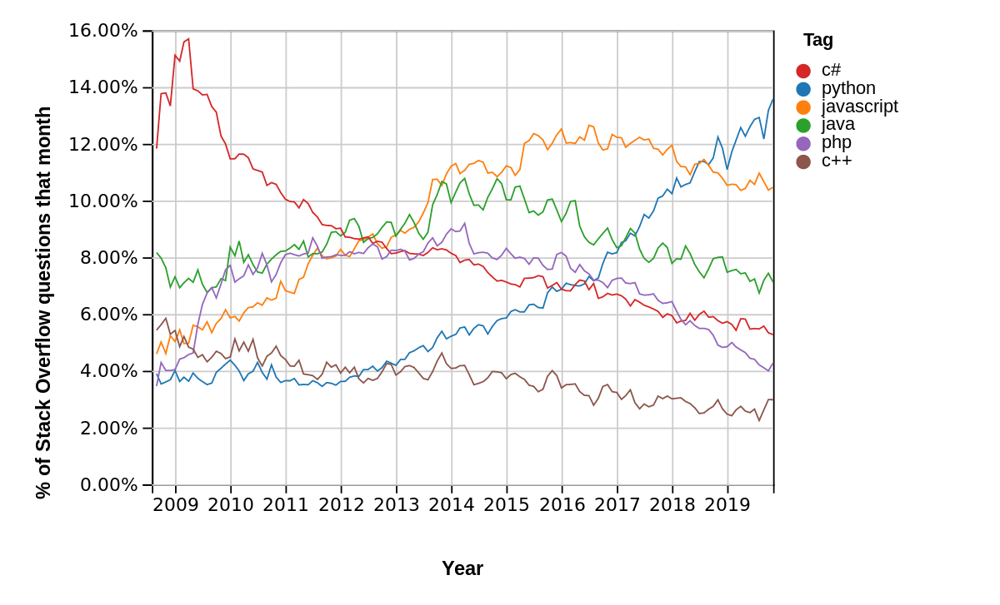

# Python 3.8
<tt>in ~38 minutes</tt>

Notes: Introduce yourself!

----

# Python : Introduction

Python est un langage de programmation permettant de s'exprimer de
manière **concise** et **lisible**.

----

# Qui utilise Python ?

YouTube, Dropbox, Reddit, Instagram, Spotify, NASA…


----

# Qui utilise Python ?



----

# Installation

https://python.org

— ou —


Notes:
- On windows use the WSL, or gitforwindows.org if you can't
- https://docs.python.org/3/using/windows.html
- https://docs.python.org/3/using/mac.html
- On windows, don't install from the Microsoft Store.

----

# Démarrer un interpréteur

Sur Windows :

```
py
```

Sur tous les autres OS :

```
python3
```

Notes:
- Définir « Interpréteur »
- `py` sur Windows trouve l'interpréteur le plus récent.

----

# L'interpréteur

Parfois appelé le *REPL* ou *la console interactive*, c'est un interpréteur interactif de Python.

```python
$ python3
>>> 10800 / 60 / 60
3.0
>>>
```

Notes:

Permet d'essayer un peu de Python sans pour autant ouvrir un fichier.

Et oui, même après 10 ans de Python, on l'utilise encore.

----

# L'interpréteur

Il en existe plusieurs : Celui natif à Python, IDLE, IPython, …

Ça ressemble soit à ça :

```bash
>>>
```
soit à ça :
```bash
In [1]:
```

----

# L'interpréteur

```python
>>> print("Hello world")
Hello world
>>>
```

Notes:

Show them the:

- Read
- Eval
- Print
- Loop (Read again)

----

# Un programme

Un programme c'est des instructions et des données.

```python
>>> print("Hello world")
```

Ici `print` c'est une fonction, "Hello world" c'est la donnée.

----

# Testons l'interpréteur

```python
>>> 10
10
```
Notes:

L'interpréteur à lu les caractères `1` `0`, a compris que c'était un
nombre entier, l'a stocké dans sa représentation interne, un objet,
puis nous l'a représenté à son tour avec deux caractères `1` et `0`
pour qu'on puisse le lire.

----

# C'est votre nouvelle calculatrice

```python
>>> 60 * 60 * 4
14400
```

----

# Les exceptions

```python
>>> 5 -* 3
  File "<stdin>", line 1
    5 -*
       ^
SyntaxError: invalid syntax
```

Notes:
Lisez *TOUJOURS* la dernière ligne en premier !

Let's give him some nonsense...
Python is explicit when something's wrong.
SyntaxError ...

---

# Les types

---

# Booléens

```python
>>> True
True
>>> False
False
```

----

# Booléens

```python
>>> True or False
True
>>> True and False
False
```

----

# Les chaînes de caractères

```python
>>> "Anne Elk's Theory"
"Anne Elk's Theory"
>>> 'Colin "Bomber" Harris'
'Colin "Bomber" Harris'
>>> """Anne Elk's Theory est "mieux"."""
'Anne Elk\'s Theory est "mieux".'
```
Notes:

Expliquer ce qu'est une chaîne, sans parler de pointeurs, on est pas
dans un cours de C89.

----


# Les listes

```python
>>> [1, 2, 3, 4, 5, 6, 7, 8]
[1, 2, 3, 4, 5, 6, 7, 8]
```

Notes:

La représentation est souvent du Python valide.

----

# Les listes

```python
>>> [1, 1.5, 2, 2.5]
[1, 1.5, 2, 2.5]
```

Notes:

Attention à ne pas en abuser.

----

# Les listes

```python
>>> [[1, 1], [1, 2], [2, 1], [2, 2]]
[[1, 1], [1, 2], [2, 1], [2, 2]]
```
Notes:
Une liste c'est de la donnée, ce qu'elle contint c'est de la donnée.

----

# *n*-uplets
```python
>>> 1, 2
(1, 2)
>>> "Graham", "John", "Terry"
('Graham', 'John', 'Terry')
```
Notes:
C'est la virgule qui fait le n-uplet, pas les parenthèses.

----

# Les ensembles
```python
>>> {2, 5, 7, 3}
{2, 3, 5, 7}
```
Notes:
Un ensemble n'est pas ordonné.

----

# Dictionnaires

```python
>>> {"Graham": 1941, "John": 1939}
{"Graham": 1941, "John": 1939}
```
Notes:
On associe une valeur à une clé.

---

# Les opérateurs

```python
>>> 10 + 10
20
>>> 1j * 1j
(-1+0j)
>>> 10.5 + 2
12.5
```

----

# Les opérateurs


```python
>>> "La vie " + "de Brian"
'La vie de Brian'
```
Notes:
It's called concatenation of strings.

----

# Les opérateurs

```python
>>> "Tu tum pak " * 2
'Tu tum pak Tu tum pak'
```
Notes:
Tant qu'il n'y a pas d'ambiguité, c'est implémenté.

----

# Les opérateurs

```python
>>> ["Graham", "John"] + [1, 2, 3]
['Graham', 'John', 1, 2, 3]
```

----

# Les Comparisons


```python
>>> 10 < 1
False
>>> 10 == 10
True
>>> 10 >= 20
False
```

----

# Test d'appartenance

```python
>>> "aa" in "sacré graal"
True
```

----

# Test d'appartenance

```python
>>> 7 in {2, 3, 5, 7, 11}
True
```


----

# Travailler avec les ensembles

```python
>>> {"a", "b"} | {"a", "x", "y"}
{'a', 'x', 'y', 'b'}
```

Notes:
C'est une union.

----

# Travailler avec les ensembles

```python
>>> {"a", "b"} & {"a", "x", "y"}
{'a'}
```

Notes:
Une intersection.

----

# Mais en cas d'ambiguité…

```python
>>> "D'oh!" * "D'oh!"
Traceback (most recent call last):
  File "<stdin>", line 1, in <module>
TypeError: can't multiply sequence by non-int of type 'str'
```

----

# Mais en cas d'ambiguité…

```python
>>> {"a", "b"} + {"a", "x", "y"}
Traceback (most recent call last):
  File "<stdin>", line 1, in <module>
TypeError: unsupported operand type(s) for +: 'set' and 'set'
```

---

# Les méthodes

```python
>>> "La vie de Brian".upper()
'LA VIE DE BRIAN'
>>> "La vie de Brian".isupper()
False
>>> "La vie de Brian".startswith("La")
True
>>> "La vie de Brian".startswith("Vie")
False
```

----

# Les variables

```python
>>> names = ["Graham", "John", "Terry"]
>>> births = {"Graham": 1941,
...           "John": 1939}
>>> names
["Graham", "John", "Terry"]
>>> births
{'Graham': 1941, 'John': 1939}

```

Notes:

On ne dit pas "la liste est mise dans la variable", on dit "la
variable names est assignée à la liste".

----

# Accès par indice

```python
>>> names[0]
'Graham'
>>> names[1]
'John'
```
Notes:
On réutilise le nom pour accéder au contenu.

Bien prendre le temps d'expliquer la syntaxe ici.

----

# Accès par clé

```python
>>> births["John"]
1939
```

---

# Les instructions

```python
>>> if births["John"] >= 2000:
...     print("John est super jeune !")
...
>>>
```

Notes:

Parler de l'indentation !

Notez le `...`, on a du appyer un coup en « entrée » pour fermer ce bloc.

----

# Les instructions

```python
>>> for name in names:
...     print(name)
...
Graham
John
Terry
>>>
```

---

# Les fonctions

```python
>>> def max(a, b):
...     if a > b:
...         return a
...     else:
...         return b
...

Notes:

Passer du temps sur la syntaxe et le vocabulaire
 - fonction
 - paramètre
 - `return`

----

# Les fonctions

```python
>>> max(10, 20)
20
```
