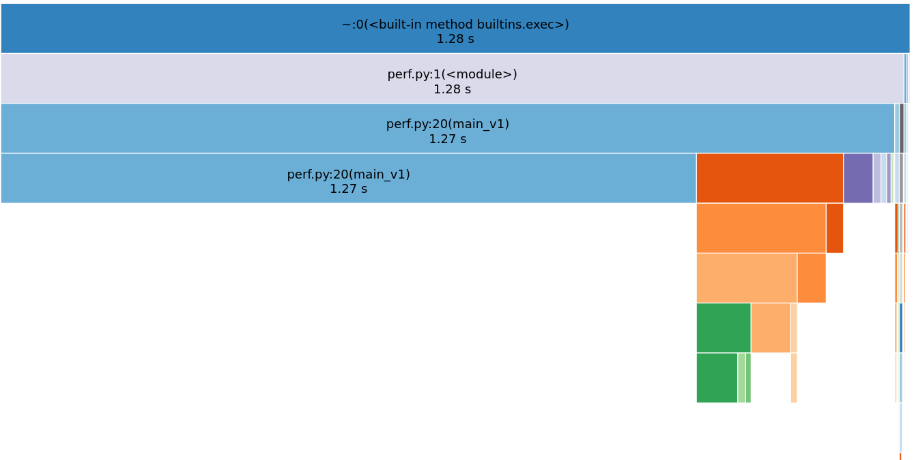
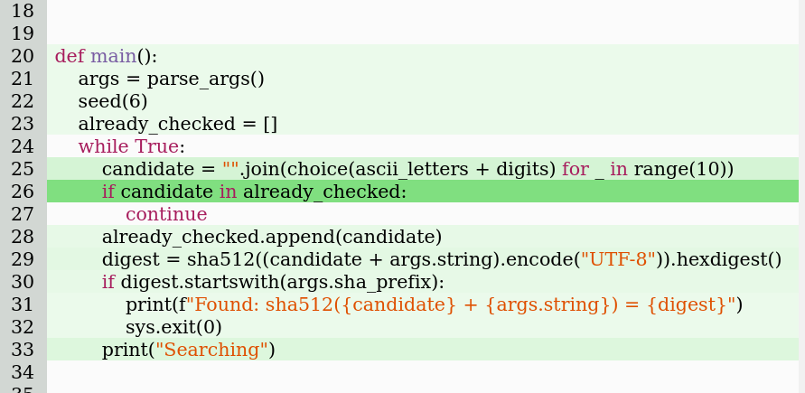
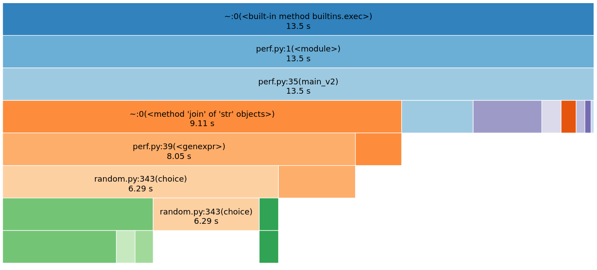
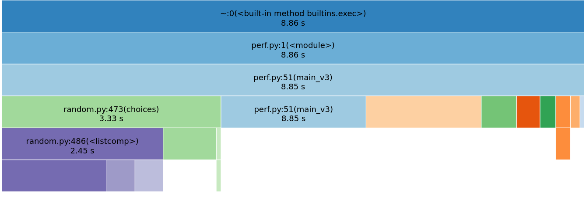
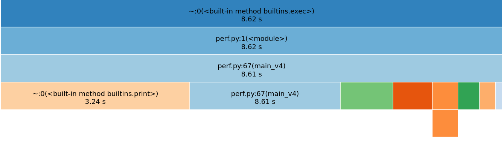
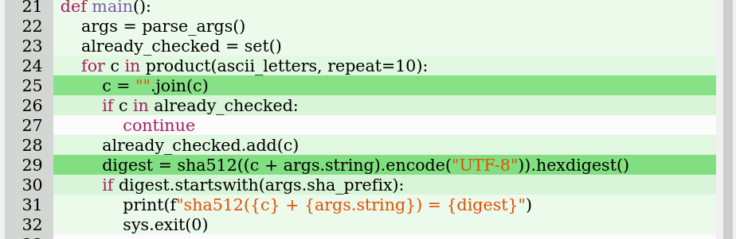
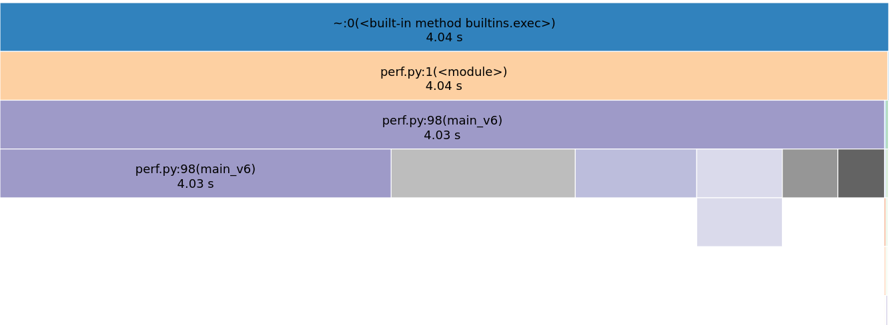

# Performance

## Le code

```python
def main():
    already_checked = []
    while True:
        c = "".join(choice(ascii_letters) for _ in range(10))
        if c in already_checked: continue
        already_checked.append(c)
        digest = sha512(
            (c + args.string).encode("UTF-8")).hexdigest()
        if digest.startswith(args.sha_prefix):
            print(f"sha512({c} + {args.string}) = {digest}")
            sys.exit(0)
        print("Searching")
```


## Premiers tests

```bash
$ time python perf.py AFPy 00
Searching
[...]
Searching
Found: sha512(5NX3dB0BrO + AFPy) = 00…

real 0m0.048s
user 0m0.040s
sys 0m0.008s
```

## Premiers tests

```bash
$ time python perf.py AFPy 000
Searching
[...]
Searching
Found: sha512(UYb0z6nac1 + AFPy) = 000…

real 0m2.797s
user 0m2.773s
sys 0m0.024s
```

## Premiers tests

```bash
$ time python perf.py AFPy 0000
Searching
[...]
Searching
Found: sha512(dX0oAzvOmm + AFPy) = 0000…

real 0m16.381s
user 0m16.375s
sys 0m0.004s
```

C'est long mais ça passe …


## Premiers tests

```bash
$ time python perf.py AFPy 00000
Searching
[...]
Searching
Searching
Searching
Searching
```

Bon, on a un sushi.

## cProfile

```bash
$ python -m cProfile -o prof perf.py AFPy 0000
```

## pstats

```bash
$ python -m pstats prof
Welcome to the profile statistics browser.
prof% sort cumulative
prof% stats 10
```

## pstats

```txt
ncalls  cumtime  percall filename:lineno(function)
  12/1   17.007   17.007 {built-in method builtins.exec}
     1   17.007   17.007 /tmp/perf.py:1(<module>)
     1   16.996   16.996 /tmp/perf.py:20(main)
 36429    0.869    0.000 {method 'join' of 'str' objects}
```

## snakeviz

```bash
$ pip install snakeviz
Collecting snakeviz
  Using cached snakeviz-2.1.0-py2.py3-none-any.whl (282 kB)
Collecting tornado>=2.0
  Using cached tornado-6.1-cp39-cp39-manylinux2010_x86_64.whl (427 kB)
Installing collected packages: tornado, snakeviz
Successfully installed snakeviz-2.1.0 tornado-6.1
```


## snakeviz

```bash
$ snakeviz prof
```

## snakeviz



## vprof

```
$ pip install vprof
Collecting vprof
  Using cached vprof-0.38-py3-none-any.whl (319 kB)
Collecting psutil>=3
  Using cached psutil-5.7.3-cp39-cp39d-linux_x86_64.whl
Installing collected packages: psutil, vprof
Successfully installed psutil-5.7.3 vprof-0.38
```

## vprof

```
$ vprof -c h "perf.py AFPy 0000"
```

## vprof




## Le code, v1

```python [2,5,6]
def main():
    already_checked = []
    while True:
        c = "".join(choice(ascii_letters) for _ in range(10))
        if c in already_checked: continue
        already_checked.append(c)
        digest = sha512(
            (c + args.string).encode("UTF-8")).hexdigest()
        if digest.startswith(args.sha_prefix):
            print(f"sha512({c} + {args.string}) = {digest}")
            sys.exit(0)
        print("Searching")
```

## Le code, v2

```python [2,5,6]
def main():
    already_checked = set()
    while True:
        c = "".join(choice(ascii_letters) for _ in range(10))
        if c in already_checked: continue
        already_checked.add(c)
        digest = sha512(
            (c + args.string).encode("UTF-8")).hexdigest()
        if digest.startswith(args.sha_prefix):
            print(f"sha512({c} + {args.string}) = {digest}")
            sys.exit(0)
        print("Searching")
```

## Les perfs

```bash
$ hyperfine 'python perf.py AFPy 00000'
```
- v1 : ∞
- v2 (`set`) : 23 s ± 23 s

::: notes

Il existe aussi pyperf: https://github.com/psf/pyperf


## cProfile + pstats

```bash
$ python -m cProfile -o prof perf.py AFPy 0000
$ python -m pstats prof
```

## cProfile + pstats
```
  ncalls  cumtime  percall filename:lineno(function)
    12/1    1.156    1.156 {built-in method builtins.exec}
       1    1.156    1.156 perf.py:1(<module>)
       1    1.143    1.143 perf.py:35(main)
   34215    0.771    0.000 {method 'join' of 'str' objects}
  371647    0.681    0.000 perf.py:39(<genexpr>)
  337860    0.526    0.000 /python3.9/random.py(choice)
  337860    0.283    0.000 /python3.9/random.py(randbelow)
   33786    0.134    0.000 built-in method print
  372745    0.037    0.000 method 'getrandbits' of Random'
   33786    0.037    0.000 method 'hexdigest' of hashlib
```

## snakeviz

```bash
$ snakeviz prof
```

## snakeviz




## Le code, v2

```python [4]
def main():
    already_checked = set()
    while True:
        c = "".join(choice(ascii_letters) for _ in range(10))
        if c in already_checked: continue
        already_checked.add(c)
        digest = sha512(
            (c + args.string).encode("UTF-8")).hexdigest()
        if digest.startswith(args.sha_prefix):
            print(f"sha512({c} + {args.string}) = {digest}")
            sys.exit(0)
        print("Searching")
```


## Le code, v3

```python [4]
def main():
    already_checked = set()
    while True:
        c = "".join(choices(ascii_letters, k=10))
        if c in already_checked: continue
        already_checked.add(c)
        digest = sha512(
            (c + args.string).encode("UTF-8")).hexdigest()
        if digest.startswith(args.sha_prefix):
            print(f"sha512({c} + {args.string}) = {digest}")
            sys.exit(0)
        print("Searching")
```

## Les perfs

```bash
$ hyperfine 'python perf.py AFPy 00000'
```
- v1 : ∞
- v2 (`set`) : 23 s ± 23 s
- v3 (`choices`): 8.591 s ± 6.525 s


## snakeviz




## Le code, v4

```python [3]
def main():
    already_checked = set()
    for c in product(ascii_letters, repeat=10):
        c = "".join(c)
        if c in already_checked: continue
        already_checked.add(c)
        digest = sha512(
            (c + args.string).encode("UTF-8")).hexdigest()
        if digest.startswith(args.sha_prefix):
            print(f"sha512({c} + {args.string}) = {digest}")
            sys.exit(0)
        print("Searching")
```

## Les perfs

```bash
$ hyperfine 'python perf.py AFPy 00000'
```
- v1 : ∞
- v2 (`set`) : 23 s ± 23 s
- v3 (`choices`): 8.591 s ± 6.525 s
- v4 (`deterministic`) : 3.900 s ±  0.121 s


## snakeviz




## Le code, v5

```python [12]
def main():
    already_checked = set()
    for c in product(ascii_letters, repeat=10):
        c = "".join(c)
        if c in already_checked: continue
        already_checked.add(c)
        digest = sha512(
            (c + args.string).encode("UTF-8")).hexdigest()
        if digest.startswith(args.sha_prefix):
            print(f"sha512({c} + {args.string}) = {digest}")
            sys.exit(0)
        # print("Searching")
```

## Les perfs

```bash
$ hyperfine 'python perf.py AFPy 00000'
```
- v1 : ∞
- v2 (`set`) : 23 s ± 23 s
- v3 (`choices`): 8.591 s ± 6.525 s
- v4 (`deterministic`) : 3.900 s ±  0.121 s
- v5 (`print`) : 3.120 s ±  0.062 s


## Snakeviz


Il reste du `hexdigest`, du `encode`, et du `join`.

## vprof



Ligne 26 et 28 !?

## Le code, v6

```python
def main():
    for c in product(ascii_letters, repeat=10):
        c = "".join(c)
        digest = sha512(
            (c + args.string).encode("UTF-8")).hexdigest()
        if digest.startswith(args.sha_prefix):
            print(f"sha512({c} + {args.string}) = {digest}")
            sys.exit(0)
```


## Snakeviz



Il reste du `hexdigest`, du `encode`, et du `join`.


## Le code, v7

```python
def main():
    string = args.string.encode("UTF-8")
    pool = ascii_letters.encode("UTF-8")
    for c in product(pool, repeat=10):
        digest = sha512(bytes(c) + string).hexdigest()
        if digest.startswith(args.sha_prefix):
            print(f"sha512({bytes(c)} + {args.string}) = "
                  f"{digest}")
            sys.exit(0)
```


## Les perfs

```bash
$ hyperfine 'python perf.py AFPy 00000'
```
- v1 : ∞
- v2 (`set`) : 23 s ± 23 s
- v3 (`choices`): 8.591 s ± 6.525 s
- v4 (`deterministic`) : 3.900 s ±  0.121 s
- v5 (`print`) : 3.120 s ±  0.062 s
- v6 (`dead code`): 2.844 s ±  0.059 s
- v7 (`bytes`) : 1.837 s ±  0.067 s


## Encore plus d'expériences

- pypy: 3.8s
- python: 1.8s
- cython (hashlib) 1.3s
- cython (crypto) 0.8s
- c: 0.3s
