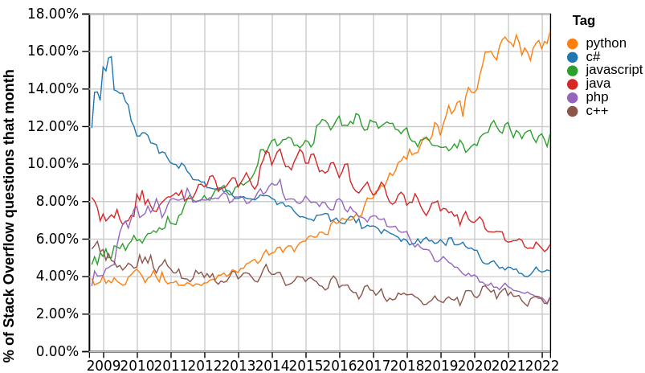

# Python

::: notes

Juste pour le doctest:
```python
x, y = 0, 0
```


## Python

par

Julien Palard <julien@palard.fr>

https://mdk.fr

::: notes

Introduce yourself!

Ça couvre les types de bases survol quelques stricutres de contrôle,
et quelques fonctions natives.


## Python : Introduction

Python est un langage de programmation permettant de s'exprimer de
manière **concise** et **lisible**.


## Qui utilise Python ?

YouTube, Dropbox, Reddit, Instagram, Spotify, NASA…


## Combien utilisent Python ?



::: notes

https://insights.stackoverflow.com/trends


## Installation

https://python.org

— ou —


::: notes

- On windows use the WSL, or gitforwindows.org if you can't
- https://docs.python.org/3/using/windows.html
- https://docs.python.org/3/using/mac.html
- On windows, don't install from the Microsoft Store.


## Démarrer un interpréteur

Sur Windows :

```text
py
```

Sur tous les autres OS :

```text
python3
```

::: notes

- Définir « Interpréteur »
- `py` sur Windows trouve l'interpréteur le plus récent.


## L'interpréteur

Parfois appelé le *REPL* ou *la console interactive*.

```bash
$ python3
>>> 10800 / 60 / 60
3.0
>>>
```

::: notes

Permet d'essayer un peu de Python sans pour autant ouvrir un fichier.

Et oui, même après 10 ans de Python, on l'utilise encore.

Expliquer les parties "R", "E", "P", "L".


## L'interpréteur

Il en existe plusieurs : Celui natif à Python, IDLE, IPython, …

Il ressemble généralement soit à ça :

```bash
>>>
```
soit à ça :
```bash
In [1]:
```


## Testons l'interpréteur

```python
>>> 10
10
```

::: notes

L'interpréteur à lu les caractères `1` `0`, a compris que c'était un
nombre entier, l'a stocké dans sa représentation interne, un objet,
puis nous l'a représenté à son tour avec deux caractères `1` et `0`
pour qu'on puisse le lire.


## C'est votre nouvelle calculatrice

```python
>>> 60 * 60 * 4
14400
```


## Les exceptions

```python
>>> 5 / 0
Traceback (most recent call last):
  File "<stdin>", line 1, in <module>
ZeroDivisionError: division by zero
```

::: notes

Lisez *TOUJOURS* la dernière ligne en premier !


# Types natifs

## Booléens

```python
>>> True
True
>>> False
False
```


## Nombres

```python
>>> 42
42
```


## Nombres

```python
>>> 18446744073709551616
18446744073709551616
```


## Nombres

```python
>>> 3.1415
3.1415
```


## Chaînes de caractères

```python
>>> "Anne Elk's Theory"
"Anne Elk's Theory"
```

::: notes

Expliquer ce qu'est une chaîne, sans parler de pointeurs, on est pas
dans un cours de C89.


## Chaînes de caractères

```python
>>> 'Colin "Bomber" Harris'
'Colin "Bomber" Harris'
```

::: notes

Les triples quotes apparaissent jour 2.


## Listes

```python
>>> [2, 3, 5, 7]
[2, 3, 5, 7]
```

::: notes

La représentation est souvent du Python valide.


## Listes

```python
>>> [1, 1.5, 2, 2.5]
[1, 1.5, 2, 2.5]
```

::: notes

Attention à ne pas abuser du mélange autorisé des types.


## Listes

```python
>>> [[1, 1], [1, 2], [2, 1], [2, 2]]
[[1, 1], [1, 2], [2, 1], [2, 2]]
```

::: notes

Une liste c'est de la donnée, ce qu'elle contint c'est de la donnée.


## *n*-uplets, *tuple*

```python
>>> 1, 2
(1, 2)
>>> "Graham", "John", "Terry"
('Graham', 'John', 'Terry')
```

::: notes

C'est la virgule qui fait le n-uplet, pas les parenthèses.

Pensez au *n*-uplet comme une structure C, *a record*, pas comme une
liste, par exemple des coordonnées : (x, y).


## Ensembles

```python
{101, 103, 107, 109}
```

::: notes

Un ensemble n'est pas ordonné.


## Dictionnaires

```python
{"Aval": "Qui se trouve du côté de la vallée.",
 "Amont": "Qui se trouve du côté de la montagne."}
```

::: notes

On associe une valeur à une clé. Utile *seulement* si on ne connaît
pas les clefs à l'avance, sinon c'est une classe.


# Les opérateurs

## Les opérateurs mathématiques

```python
>>> 10 + 10
20
>>> 10.5 + 2
12.5
```


## Les opérateurs mathématiques

```python
>>> (4 * 10 ** 1) + (2 * 10 ** 0)
42
```

## Les opérateurs mathématiques

```python
>>> 10 / 2
5.0
```

## Les opérateurs


```python
>>> "La vie " + "de Brian"
'La vie de Brian'
```

::: notes

It's called concatenation of strings.


## Les opérateurs

```python
>>> "Tu tum pak " * 2
'Tu tum pak Tu tum pak '
```

::: notes

Tant qu'il n'y a pas d'ambiguité, c'est implémenté.


## Les opérateurs

```python
>>> [2, 3, 5] + [7, 11, 13, 17]
[2, 3, 5, 7, 11, 13, 17]
```


## Les Comparisons


```python
>>> 10 < 1
False
>>> 10 == 10
True
>>> 10 >= 20
False
```

::: notes

Déconseiller l'utilisation de `is`, de toute facons PyLint leur dira
quand l'utiliser.


## Logique

```python
>>> True or False
True
>>> True and False
False
>>> not True
False
```

::: notes

On utilisera ça plus tard, avec les structures de contrôle.


## Test d'appartenance

```python
>>> "aa" in "sacré graal"
True
```


## Test d'appartenance

```python
>>> 7 in {2, 3, 5, 7, 11}
True
```


## Travailler avec les ensembles

```python
>>> {1, 2} | {1, 3, 4} == {1, 2, 3, 4}
True
```

::: notes

C'est une union.


## Travailler avec les ensembles

```python
>>> {"a", "b"} & {"a", "x", "y"}
{'a'}
```

::: notes

Une intersection.


## Mais en cas d'ambiguité…

```python
>>> "D'oh!" * "D'oh!"
Traceback (most recent call last):
  File "<stdin>", line 1, in <module>
TypeError: can't multiply sequence by non-int of type 'str'
```


## Mais en cas d'ambiguité…

```python
>>> {"a", "b"} + {"a", "x", "y"}
Traceback (most recent call last):
  File "<stdin>", line 1, in <module>
TypeError: unsupported operand type(s) for +: 'set' and 'set'
```


# Les variables

## Affectation

```python
>>> x = 10
>>> y = 10
>>> x + y
20
```

::: notes

« x » est assigné à 10.

JAMAIS dire: 10 est assigné à « x ».
JAMAIS JAMAIS dire : On met 10 dans « x ».


## Affectation multiple

```python
>>> x, y = 2, 3
>>> x
2
>>> y
3
```


## Accès par indice

```python
>>> first_primes = [2, 3, 5, 7, 11, 13]
>>> first_primes[0]
2
>>> first_primes[1]
3
```

::: notes

On réutilise le nom pour accéder au contenu.

Bien prendre le temps d'expliquer la syntaxe ici.


## Accès par clé

```python
>>> d = {"zero": 0, "un": 1, "deux": 2}
>>> d["deux"] + d["deux"]
4
```


# Les fonctions natives

## print

```python
>>> print("zero")
zero
```

::: notes

C'est leur première fonction, s'attarder sur la syntaxe !


## print

```python
>>> print("√2 =", 2 ** 0.5)
√2 = 1.4142135623730951
```

::: notes

En effet, le P de REPL étant `print`, le print est implicite dans un REPL.

Mais le REPL sert a tester : on peut bien tester print dans le REPL.

Exercices:
 - Print 42
 - Number of seconds in a year
 - Using operators

## str, list, int, ...

```python
>>> str(12)
'12'
```

## str, list, int, ...

```python
>>> int("12")
12
```


## len

```python
>>> len([1, 2, 3])
3
>>> len("Bonjour")
7
```

::: notes

Exercise: Character counting

## range

```python
>>> list(range(10))
[0, 1, 2, 3, 4, 5, 6, 7, 8, 9]
>>> list(range(5, 10))
[5, 6, 7, 8, 9]
```


## help

Affiche la documentation de n'importe quoi, essayez :

   - `help(str)`
   - `help(list)`
   - ...

::: notes

Accepte aussi une valeur (et donc une variable) mais attention : si la
variable est une chaîne, `help` n'affichera pas la documentation des
chaînes.


## sorted

```python
>>> sorted({2, 1, 7, 6})
[1, 2, 6, 7]
```


# Les instructions

## if

```python
if 1 in {2, 3, 5, 7, 11}:
    print("1 serait-il premier ?")
```

::: notes

Parler de l'indentation !

Notez le `...`, on a du appyer un coup en « entrée » pour fermer ce bloc.

1 était premier, avant, mais ça casse le théorème « Every possible
whole number can be written as a _unique_ product of primes ».


## Le `else`

Après un bloc `if`, on peut ajouter un bloc `else` :

```python
if x % 2 == 0:
    print("x est pair.")
else:
    print("x est impair.")
```


## Le `elif`

Après un `if`, on peut ajouter un ou des bloc `elif` :

```python
if (x, y) == (0, 0):
    print("Point à l'origine")
elif x == 0:
    print("Point sur l'abscisse")
elif y == 0:
    print("Point sur l'ordonnée")
else:
    print("Point ailleurs")
```

::: notes

Parler de `pass` et de `...`.


## for

```python
>>> for number in 1, 2, 3:
...     print(number)
...
1
2
3
```


## for

```python
>>> d = {"zero": 0, "un": 1, "deux": 2}
>>> for number, value in d.items():
...     print(number, value)
...
zero 0
un 1
deux 2
>>>
```


## for

```python
>>> for i in range(5):
...     print(i)
0
1
2
3
4
```

::: notes

Exercice : Square numbers, powers of two, comparisons.

## L'instruction `while`

Très rarement utilisée car le `for` est bien plus pratique, sert
cependant dans quelques cas:

- `while True:`
- `while il_reste_du_travail_à_faire:`


## L'instruction `while`

```python
>>> sq = 5
>>> guess = 2
>>> error = abs(sq - guess * guess)
>>> while error > 0.0001:
...     guess = (guess + sq / guess) / 2
...     error = abs(sq - guess * guess)
>>> guess
2.2360679779158037
```

::: notes

C'est la méthode de Héron, mais ne pas rentrer dans le détail, juste
montrer la ligne du while, les laisser revenir dessus plus tard s'ils
le veulent.


# Les méthodes

## Sur les chaînes
```python
>>> s = "The prime numbers."
>>> s.title()
'The Prime Numbers.'
>>> s.startswith("The")
True
>>> s.split()
['The', 'prime', 'numbers.']
```

::: notes

Exercise : Counting Words.

## Sur les chaînes

```python
>>> s = "phi = {}"
>>> s.format((1 + 5 ** 0.5) / 2)
'phi = 1.618033988749895'
```


## Sur les listes

```python
>>> l = [2, 3, 5, 7]
>>> l.append(11)
>>> l.sort(reverse=True)
>>> l
[11, 7, 5, 3, 2]
```


## Sur les dictionnaires

```python
>>> d = {"Aval": "Du côté de la vallée.",
...      "Amont": "Du côté de la montagne."}
>>> d.items()
dict_items([('Aval', 'Du côté de la vallée.'), ('Amont', 'Du côté de la montagne.')])
```


# Les variables (suite)


## Le type des variables

En Python, les variables ne sont que des noms.

*Des « étiquettes » qu'on colle aux objets.*

Seul les valeurs sont typées.

*Toutes les valeurs sont des objets.*

::: notes

Sans. Exceptions.

On peut « coller » plusieurs étiquettes à une même valeur.

C'est pour ça que pour `n = 10` on dit "n est assigné à 10", et non "10 est mis dans n".


## Immuables vs modifiables

Certains types sont modifiables, d'autres, non.

::: notes

On dit qu'elles sont immuables (*immutable* en anglais).

Attention, les variables sont toujours ... variables, nous n'avons pas
de constantes.


## Les types modifiables

- On peut ajouter à une liste.
- On peut vider un ensemble.
- On peut supprimer une clef d'un dictionnaire.
- ...

::: notes

- Listes
- Dictionnaires
- Ensembles
- ...


## Les types immuables

- On ne peut pas dire que maintenant 10 vaut 12.
- Ni que faux devient vrai.
- Ni qu'une paire contient maintenant trois éléments.
- ...

::: notes

- Les chaînes
- Les *n*-uplets
- Les entiers
- Les booléens
- ...

Pour les chaînes c'est discutable, mais avoir des chaînes immuables
est confortable (clef de dictionnaires par exemple, ou la garantie
qu'un appel à une fonction avec une chaîne en paramètre ne va pas la
modifier).


## La vérité

En Python, ce qui est vide est faux, `0` est faux, `None` est faux,
`False` est faux. Le reste est vrai :

```python
>>> bool("Non vide")
True
>>> bool([])  # Une liste vide
False
>>> bool(0.0)
False
```

::: notes

Attention à la sémantique : `if foo` est différent de `if foo is True`.

Leur rappeler que c'est pylint qui leur dira quand utiliser `is`, leur
dire quand même : pour `True`, `False`, et `None`.


# Les fonctions

Créer ses propres fonctions


## Syntaxe

```python
def ma_fonction(ses_paramètres):
    ...  # Le corps de la fonction
```

::: notes

Passer du temps sur la syntaxe et le vocabulaire
 - fonction
 - paramètre, argument
 - `return`

## Exemple

```python
def add(a, b):
    return a + b

print(add(1, 2))
```

## Paramètres

Une fonction prend des paramètres et renvoie une valeur.

```python
def is_even(value):
    return value % 2 == 0
```

## Arguments

On peut donc lui donner des arguments :
```python
>>> print(is_even(10))
True
```

## La portée des variables

Dans une fonction :
- Si on ne fait qu'accéder, ce sera une globale.
- Si on affecte, c'est une locale.

::: notes

Pour l'accès pensez à `print` par exemple, l'utiliser n'en fait pas une locale.
Une variable ne peut *presque* jamais ne pas contenir de valeur, et on ne peut pas la "déclarer".


## Importer des modules

```python
import math

print(math.factorial(42))
```


# Les chaînes

```python
>>> """Anne Elk's Theory est "mieux"."""
'Anne Elk\'s Theory est "mieux".'
```

## Les docstrings

```python
def une_fonction():
    """Une courte description."""
    ...
    return ...
```

# Les nombres

## Les opérateurs mathématiques

```python
>>> 0.1 + 0.1
0.2
```


## Les opérateurs mathématiques

```python
>>> 0.1 + 0.2
0.30000000000000004
```

::: notes

https://0.30000000000000004.com


# `for` et `while`

## `break` et `continue`

Break sert à interrompre une boucle, continue sert à passer à l'élément
suivant. Qu'on soit dans un `for` ou dans un `while`.


## `break`

```python
>>> sq, gues = 5, 2
>>> while True:
...     gues = (gues + sq / gues) / 2
...     error = abs(sq - gues * gues)
...     if error < 0.0001:
...         break
>>> gues
2.2360679779158037
```


## `continue`

```python-repl
>>> for i in range(5):
...     if i == 0:
...         continue
...     print(i)
1
2
3
4
```


## Les exceptions : `try`

```python
>>> try:
...     int("abc")
... except ValueError:
...     print("Raté")
Raté
```


# La notation en compréhension

C'est transformer ça :

```python
>>> accumulator = []
>>> for i in range(10):
...    accumulator.append(2 ** i)
>>> accumulator
[1, 2, 4, 8, 16, 32, 64, 128, 256, 512]
```


## La notation en compréhension

en :

```python
>>> [2 ** i for i in range(10)]
[1, 2, 4, 8, 16, 32, 64, 128, 256, 512]
```


## La notation en compréhension

Ou :

```python
def phi(n):
    numbers = []
    for i in range(n):
        if math.gcd(i, n) == 1:
            numbers.append(i)
    return len(numbers)
```


## La notation en compréhension

en :

```python
def phi(n):
    return len(
        [
            i
            for i in range(n)
            if math.gcd(i, n) == i
        ]
    )

```

::: notes

Elle devrait s'écrire sur une seule ligne, mais, vidéoprojecteur...


# Les *slices*

*slices* en anglais

Notes:
```python
seq = list("ABCDEF")
```


## Les *slices*

```python
>>> seq
['A', 'B', 'C', 'D', 'E', 'F']
>>> seq[0]
'A'
```


## Les *slices*

```python
>>> seq[0:3]
['A', 'B', 'C']
```


## Les *slices*

```python
>>> seq[3:6]
['D', 'E', 'F']
```


## Les *slices*

```python
>>> seq[:]
['A', 'B', 'C', 'D', 'E', 'F']
```


## Les *slices*

```python
>>> seq[1:]
['B', 'C', 'D', 'E', 'F']
```


## Les *slices*

```python
>>> seq[-1]
'F'
```


## Les *slices*

```python
>>> seq[:-2]
['A', 'B', 'C', 'D']
```


## Les *slices*

```python
>>> seq[0:5:2]
['A', 'C', 'E']
```


## Les *slices*

```python
>>> seq[::-1]
['F', 'E', 'D', 'C', 'B', 'A']
```


## Les *slices*

`seq[<start>:<stop>:<step>]`


# Les classes


## La syntaxe

```python
class LeNomDeLaClasse:
    """Sa docstring, comme pour une
    fonction.
    """
    # Le corps de la classe.
```

Notes:

Dédiaboliser l'héritage, l'héritage multiple, les interfaces,
les classes abstraites, les méthodes virtuelles, ...


## À retenir

On pourrait trier les données en deux types :

- celles dont on connaît les attributs → classes
- celles dont on ne connaît pas les attributs → dictionnaires


Notes:

Le contexte, le métier, les bibliothèques utilisées peuvent générer
des cas particuliers, cette règle n'est pas absolue.

préciser peut être : "dont on connaît à toutes les étapes du programme".


## Exemple

```python
class Point:
    def __init__(self, x, y):
        self.x = x
        self.y = y
```

Notes: On connaît les attributs.


## Exemple

```python
>>> ISIN = {
...   "GLE": "FR0000130809",
...   "PARRO": "FR0004038263",
...   "AM": "FR0000121725",
... }
```

Notes: On ne les connaît pas.


## Syntaxe → les méthodes

```python
class Dice:
    def throw(self):
        self.value = 4
        # Chosen by fair dice roll.
        # Guaranteed to be random.
```

Notes: Une classe *ne sert pas* à stocker des fonctions, mais des
données. Pensez aux structs C.

La données d'abord, l'algorithme après.


## Syntaxe → le constructeur

```python
class DiceCup:
    def __init__(self, dices):
        self.dices = dices

    def shake(self):
        ...
```

Notes: Leur faire faire implémenter le __repr__, min, max, et mean.

Leur faire faire 1000 tirages dans un Counter, avec des valeurs ENTIẼRES.


## Utilisation

```python
>>> dice = Dice()
>>> dice.throw()
>>> dice.value
4
```


## Utilisation

```python
>>> cup = DiceCup(
...    [Dice() for _ in range(10)]
... )
>>> cup.shake()
```

Notes:

Faire quelques exemples d'héritage simples avant de passer a la suite.

super() considered super() !


# pip, venvs, conda


## pip

C'est l'outil standard pour installer un paquet.

```bash
$ python3 -m pip install <package-name>
```

Mais, ça installe où ?


## venv

C'est l'outil standard pour indiquer où installer les paquets.

*On peut ainsi avoir plusieurs environnements, un par projet par exemple*.

Notes:

Pratique pour avoir des versions différentes.


## venv

```bash
$ python3 -m venv --prompt test .venv/
$ source .venv/bin/activate
(test) $ python3 -m pip install pytest
```

Notes: Dépendant du shell, les envoyer sur library/venv.html.
Insister sur le côté "trashable du venv" :
- Ne rien mettre dans .venv
- rm -fr .venv  # au moindre souci


## conda

```bash
$ conda create --name test
$ conda activate test
(test) $ conda install numpy
```


# Les bonnes pratiques

Notes: Prérequis: pip et venv.


## Bonnes habitudes

> There are 2 hard problems in computer science: cache invalidation,
> naming things, and off-by-1 errors.


## Bonnes habitudes

Pas plus de 7.


## Garder son code lisible

Attention au code vieillissant, au « je ne rajoute qu'une ligne ou
deux à cette fonction et c'est réglé ».

Notes: Deux ans après la fonction fait 800 lignes, et personne ne l'a
vu venir. flake8 peut aider.


## Garder son API évolutive

Utilisez correctement `/` et `*` dans les prototypes de fonction.

Notes:

help(sum)


## Les « linters »

Il existe plusieurs outils pour « relire » votre code :
- flake8,
- pylint,
- mypy,
- black,
- bandit,
- isort.

Et un pour les unifier tous : `tox`.

Notes: Leur faire implémenter un `is_prime(x)` pour jouer avec.

La règle des 7.


## flake8

Dans un venv :

```bash
(test) $ pip install flake8
(test) $ pip install flake8-bugbear
(test) $ flake8 --max-complexity 9 *.py
```

Notes:

Flake8 est rapide, n'effectuant pas les `imports` il ne peut repérer
qu'une catégorie de problèmes.

9 est trop bas, 15 est probablement un bon choix.


## pylint

```bash
(test) $ pip install pylint
(test) $ pylint is_prime.py
```


## mypy

`mypy` fonctionne avec des annotations de types.

```bash
(test) $ pip install mypy
(test) $ mypy is_prime.py
```

Notes: --ignore-missing-imports


## bandit

Bandit cherche les failles de sécurité...

```bash
(test) $ pip install bandit
(test) $ bandit is_prime.py
```


## tox

Permet de lancer les tests:
- sur plusieurs interpréteurs (s'ils sont installés),
- de plusieurs outils,
- en parallèle.

Notes: c.f. gh/JulienPalard/oeis.


# `*`, `**`


## `*`

Signifie « plusieurs », comme dans une liste ou un *n*-uplet.

```python
>>> begin, *rest = range(5)
>>> begin
0
>>> rest
[1, 2, 3, 4]
```

Notes:

Attention, initiation : Le but est de savoir que ça existe, savoire le
lire.

Équivaut à:
begin, rest = seq[0], seq[1:]


## `*`

```python
>>> def sum(*args):
...    print(args)
...
>>> sum(1, 2, 3, 4, 5)
(1, 2, 3, 4, 5)
```


## `*`

```python
>>> [0, 0, 0, *range(3)]
[0, 0, 0, 0, 1, 2]
```


## `*`

```python
>>> print(*range(5))
0 1 2 3 4
```


## `**`

Signifie « plusieurs, nommés », comme dans un dictionnaire.


```python
>>> def p(**kwargs):
...    for key, value in kwargs.items():
...        print(key, "→", value)
...
>>> p(x=10, y=12)
x → 10
y → 12
```


## `**`

```python
>>> defaults = {"path": "./",
...             "pattern": "*.txt"}
>>> {**defaults, "pattern": "*.md"}
{'path': './', 'pattern': '*.md'}
```


## `**`

```python
>>> def p(x, y):
...    print(f"x → {x}")
...    print(f"y → {y}")
...
>>> point = {"x": 10, "y": 12}
>>> p(**point)
x → 10
y → 12
```


# L'encodage


## encoder

C'est transformer une chaîne en octets, pour son transport ou stockage :

```python
>>> "L'été".encode()
b"L'\xc3\xa9t\xc3\xa9"
>>> list("L'été".encode())
[76, 39, 195, 169, 116, 195, 169]
```


## décoder

C'est le contraire ...

```python
>>> bytes([76, 39, 195, 169, 116, 195, 169]).decode()
"L'été"
```

Notes:

Parler d'unicode, d'UTF-8, de latin-1. Ne pas oubilier de mentionner
que latin-1 et companie sont à taille fixe, et qu'UTF-8 est à taille
variable.


# Le packaging


## Le packaging

Restez dans les standards : `pyproject.toml`, `setup.cfg`.


## pyproject.toml et setup.cfg

- https://github.com/JulienPalard/oeis
- https://setuptools.readthedocs.io/


## pip

```bash
(test) $ pip install -e .
```


## pytest

```bash
(test) $ mkdir tests/
(test) $ pip install pytest
(test) $ editor tests/test_dice.py
```

Notes: C'est l'occasion de parler de assert.


## hypothesis

```python
from hypothesis import given
from hypothesis.strategies import integers

@given(integers(min_value=2,
                max_value=1000))
def test_fib(i):
    assert fib(i) == fib(i-1) + fib(i-2)
```


## pdb

```
breakpoint()
```


## PYTHONDEVMODE=y

Et `./configure --with-pydebug`.

Notes: Voir mon bashrc :] Surtout "viable" depuis la 3.8.


# Les modules utiles

- argparse
- re
- csv (quand on a pas Pandas)
- subprocess


# La communauté

> Come for the language, stay for the community

— Brett Cannon


## Les PyCons

La PyConFr (tous les ans, sauf cette année) ! Les meetups locaux hors période de pandémie !
