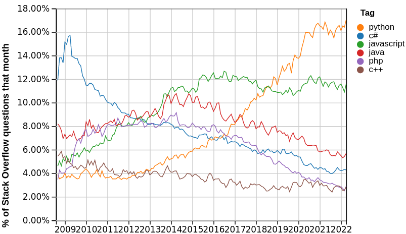

# Python 3.8 & 3.9

::: notes

Juste pour le doctest:
```python
x, y = 0, 0
```


## Python 3.8 & 3.9

par

Julien Palard <julien@palard.fr>

https://mdk.fr

::: notes

Introduce yourself!

Ça couvre les types de bases survol quelques stricutres de contrôle,
et quelques fonctions natives.


## Python : Introduction

Python est un langage de programmation permettant de s'exprimer de
manière **concise** et **lisible**.


## Qui utilise Python ?

YouTube, Dropbox, Reddit, Instagram, Spotify, NASA…


## Combien utilisent Python ?



::: notes

https://insights.stackoverflow.com/trends


## Installation

https://python.org

— ou —


::: notes

- On windows use the WSL, or gitforwindows.org if you can't
- https://docs.python.org/3/using/windows.html
- https://docs.python.org/3/using/mac.html
- On windows, don't install from the Microsoft Store.


## Démarrer un interpréteur

Sur Windows :

```text
py
```

Sur tous les autres OS :

```text
python3
```

::: notes

- Définir « Interpréteur »
- `py` sur Windows trouve l'interpréteur le plus récent.


## L'interpréteur

Parfois appelé le *REPL* ou *la console interactive*.

```bash
$ python3
>>> 10800 / 60 / 60
3.0
>>>
```

::: notes

Permet d'essayer un peu de Python sans pour autant ouvrir un fichier.

Et oui, même après 10 ans de Python, on l'utilise encore.

Expliquer les parties "R", "E", "P", "L".


## L'interpréteur

Il en existe plusieurs : Celui natif à Python, IDLE, IPython, …

Il ressemble généralement soit à ça :

```bash
>>>
```
soit à ça :
```bash
In [1]:
```


## Testons l'interpréteur

```python
>>> 10
10
```

::: notes

L'interpréteur à lu les caractères `1` `0`, a compris que c'était un
nombre entier, l'a stocké dans sa représentation interne, un objet,
puis nous l'a représenté à son tour avec deux caractères `1` et `0`
pour qu'on puisse le lire.


## C'est votre nouvelle calculatrice

```python
>>> 60 * 60 * 4
14400
```


## Les exceptions

```python
>>> 5 / 0
Traceback (most recent call last):
  File "<stdin>", line 1, in <module>
ZeroDivisionError: division by zero
```

::: notes

Lisez *TOUJOURS* la dernière ligne en premier !


# Types natifs

Les types natifs, leurs opérateurs et leurs méthodes, les variables.


## Booléens

```python
>>> True
True
>>> False
False
```


## Nombres

```python
>>> 42
42
```


## Nombres

```python
>>> 18446744073709551616
18446744073709551616
```


## Nombres

```python
>>> 3.1415
3.1415
```


## Chaînes de caractères

```python
>>> "Anne Elk's Theory"
"Anne Elk's Theory"
```

::: notes

Expliquer ce qu'est une chaîne, sans parler de pointeurs, on est pas
dans un cours de C89.


## Chaînes de caractères

```python
>>> 'Colin "Bomber" Harris'
'Colin "Bomber" Harris'
```

::: notes

Les triples quotes apparaissent jour 2.


## Listes

```python
>>> [2, 3, 5, 7]
[2, 3, 5, 7]
```

::: notes

La représentation est souvent du Python valide.


## Listes

```python
>>> [1, 1.5, 2, 2.5]
[1, 1.5, 2, 2.5]
```

::: notes

Attention à ne pas abuser du mélange autorisé des types.


## Listes

```python
>>> [[1, 1], [1, 2], [2, 1], [2, 2]]
[[1, 1], [1, 2], [2, 1], [2, 2]]
```

::: notes

Une liste c'est de la donnée, ce qu'elle contint c'est de la donnée.


## *n*-uplets, *tuple*
```python
>>> 1, 2
(1, 2)
>>> "Graham", "John", "Terry"
('Graham', 'John', 'Terry')
```

::: notes

C'est la virgule qui fait le n-uplet, pas les parenthèses.

Pensez au *n*-uplet comme une structure C, *a record*, pas comme une
liste, par exemple des coordonnées : (x, y).


## Ensembles

```python
>>> {101, 103, 107, 109}
{109, 107, 101, 103}

```

::: notes

Un ensemble n'est pas ordonné.


## Dictionnaires

```python
{"Aval": "Qui se trouve du côté de la vallée.",
 "Amont": "Qui se trouve du côté de la montagne."}
```

::: notes

On associe une valeur à une clé. Utile *seulement* si on ne connaît
pas les clefs à l'avance, sinon c'est une classe.


# Les opérateurs

## Les opérateurs mathématiques

```python
>>> 10 + 10
20
>>> 10.5 + 2
12.5
```


## Les opérateurs mathématiques

```python
>>> (4 * 10 ** 1) + (2 * 10 ** 0)
42
```

## Les opérateurs mathématiques

```python
>>> 10 / 2
5.0
```

## Les opérateurs


```python
>>> "La vie " + "de Brian"
'La vie de Brian'
```

::: notes

It's called concatenation of strings.


## Les opérateurs

```python
>>> "Tu tum pak " * 2
'Tu tum pak Tu tum pak '
```

::: notes

Tant qu'il n'y a pas d'ambiguité, c'est implémenté.


## Les opérateurs

```python
>>> [2, 3, 5] + [7, 11, 13, 17]
[2, 3, 5, 7, 11, 13, 17]
```


## Les Comparisons


```python
>>> 10 < 1
False
>>> 10 == 10
True
>>> 10 >= 20
False
```

::: notes

Déconseiller l'utilisation de `is`, de toute facons PyLint leur dira
quand l'utiliser.


## Logique

```python
>>> True or False
True
>>> True and False
False
>>> not True
False
```


## Test d'appartenance

```python
>>> "aa" in "sacré graal"
True
```


## Test d'appartenance

```python
>>> 7 in {2, 3, 5, 7, 11}
True
```


## Travailler avec les ensembles

```python
>>> {1, 2} | {1, 3, 4} == {1, 2, 3, 4}
True
```

::: notes

C'est une union.


## Travailler avec les ensembles

```python
>>> {"a", "b"} & {"a", "x", "y"}
{'a'}
```

::: notes

Une intersection.


## Mais en cas d'ambiguité…

```python
>>> "D'oh!" * "D'oh!"
Traceback (most recent call last):
  File "<stdin>", line 1, in <module>
TypeError: can't multiply sequence by non-int of type 'str'
```


## Mais en cas d'ambiguité…

```python
>>> {"a", "b"} + {"a", "x", "y"}
Traceback (most recent call last):
  File "<stdin>", line 1, in <module>
TypeError: unsupported operand type(s) for +: 'set' and 'set'
```


# Les variables

## Affectation

```python
>>> x = 10
>>> y = 10
>>> x + y
20
```

::: notes

« x » est assigné à 10.

JAMAIS dire: 10 est assigné à « x ».
JAMAIS JAMAIS dire : On met 10 dans « x ».


## Affectation multiple

```python
>>> x, y = 2, 3
>>> x
2
>>> y
3
```


## Accès par indice

```python
>>> first_primes = [2, 3, 5, 7, 11, 13]
>>> first_primes[0]
2
>>> first_primes[1]
3
```

::: notes

On réutilise le nom pour accéder au contenu.

Bien prendre le temps d'expliquer la syntaxe ici.


## Accès par clé

```python
>>> d = {"zero": 0, "un": 1, "deux": 2}
>>> d["deux"] + d["deux"]
4
```


# Les méthodes

## Sur les chaînes
```python
>>> s = "The prime numbers."
>>> s.title()
'The Prime Numbers.'
>>> s.startswith("The")
True
>>> s.split()
['The', 'prime', 'numbers.']
```


## Sur les chaînes

```python
>>> s = "phi = {}"
>>> s.format((1 + 5 ** 0.5) / 2)
'phi = 1.618033988749895'
```


## Sur les listes

```python
>>> l = [2, 3, 5, 7]
>>> l.append(11)
>>> l.sort(reverse=True)
>>> l
[11, 7, 5, 3, 2]
```


## Sur les dictionnaires

```python
>>> d = {"Aval": "Du côté de la vallée.",
...      "Amont": "Du côté de la montagne."}
>>> d.keys()
dict_keys(['Aval', 'Amont'])
>>> d.values()
dict_values(['Du côté de la vallée.', 'Du côté de la montagne.'])
>>> d.items()
dict_items([('Aval', 'Du côté de la vallée.'), ('Amont', 'Du côté de la montagne.')])
```


# Les fonctions natives


## print

```python
>>> print("zero")
zero
```

::: notes

C'est leur première fonction, s'attarder sur la syntaxe !


## print

```python
>>> print("√2 =", 2 ** 0.5)
√2 = 1.4142135623730951
```

::: notes

En effet, le P de REPL étant `print`, le print est implicite dans un REPL.

Mais le REPL sert a tester : on peut bien tester print dans le REPL.

## str, list, int, ...

```python
>>> str(12)
'12'
```

## str, list, int, ...

```python
>>> int("12")
12
```


## len

```python
>>> len([1, 2, 3])
3
>>> len("Bonjour")
7
```


## range

```python
>>> list(range(10))
[0, 1, 2, 3, 4, 5, 6, 7, 8, 9]
>>> list(range(5, 10))
[5, 6, 7, 8, 9]
```


## help

Affiche la documentation de n'importe quoi, essayez :

   - `help()` pour un mode interactif.
   - `help(str)`
   - `help(list)`
   - `help("list")`

::: notes

Accepte aussi une variable mais attention: si la variable est une
chaîne, help n'affichera pas la documentation des chaînes.


## enumerate

```python
>>> jours = ["lundi", "mardi", "mercredi"]
>>> list(enumerate(jours))
[(0, 'lundi'), (1, 'mardi'), (2, 'mercredi')]
```


## sorted

```python
>>> sorted({2, 1, 7, 6})
[1, 2, 6, 7]
```


## exit

Appeler `exit()` quitte simplement le REPL.

::: notes

Préferer `sys.exit()` dans un programme.


# Les instructions


## if

```python
if 1 in {2, 3, 5, 7, 11}:
    print("1 serait-il premier ?")
```

::: notes

Parler de l'indentation !

Notez le `...`, on a du appyer un coup en « entrée » pour fermer ce bloc.

1 était premier, avant, mais ça casse le théorème « Every possible
whole number can be written as a _unique_ product of primes ».


## Le `else`

Après un bloc `if`, on peut ajouter un bloc `else` :

```python
if x % 2 == 0:
    print("x est pair.")
else:
    print("x est impair.")
```


## Le `elif`

Après un `if`, on peut ajouter un ou des bloc `elif` :

```python
if (x, y) == (0, 0):
    print("Point à l'origine")
elif x == 0:
    print("Point sur l'abscisse")
elif y == 0:
    print("Point sur l'ordonnée")
else:
    print("Point ailleurs")
```

::: notes

Parler de `pass` et de `...`.


## for

```python
>>> for number in 1, 2, 3:
...     print(number)
...
1
2
3
```


## for

```python
>>> d = {"zero": 0, "un": 1, "deux": 2}
>>> for number, value in d.items():
...     print(number, value)
...
zero 0
un 1
deux 2
>>>
```


## for

```python
>>> for i in range(5):
...     print(i)
0
1
2
3
4
```


## L'instruction `while`

Très rarement utilisée car le `for` est bien plus pratique, sert
cependant dans quelques cas:

- `while True:`
- `while il_reste_du_travail_à_faire:`


## L'instruction `while`

```python
>>> sq = 5
>>> gues = 2
>>> error = abs(sq - gues * gues)
>>> while error > 0.0001:
...     gues = (gues + sq / gues) / 2
...     error = abs(sq - gues * gues)
>>> gues
2.2360679779158037
```

::: notes

Je sais pour la faute de frappe sur guess, mais sinon ça dépasse.

Méthode de Héron.


# Les variables (suite)


## Le type des variables

En Python, les variables ne sont que des noms.

*Des « étiquettes » qu'on colle aux objets.*

Seul les valeurs sont typées.

*Toutes les valeurs sont des objets.*

::: notes

Sans. Exceptions.

On peut « coller » plusieurs étiquettes à une même valeur.

C'est pour ça que pour `n = 10` on dit "n est assigné à 10", et non "10 est mis dans n".


## Immuables vs modifiables

Certains types sont modifiables, d'autres, non.

::: notes

On dit qu'elles sont immuables (*immutable* en anglais).

Attention, les variables sont toujours ... variables, nous n'avons pas
de constantes.


## Les types modifiables

Parmis les types modifiables on trouve :

Les listes, les dictionnaires, les ensembles, …

*On peut ajouter a une liste, modifier la valeur pour une clé d'un
dictionnaire, ou vider un ensemble par exemple.*


## les types immuables

Parmis les types immuables on trouve :

Les chaînes de caractères, les *n*-uplets, les entiers, les booléens, …

*On ne peut pas dire que maintenant 10 vaut 12, ni que faux est vrai.*


::: notes

Pour les chaînes c'est discutable, mais avoir des chaînes immuables
est confortable (clef de dictionnaires par exemple, ou la garantie
qu'un appel à une fonction avec une chaîne en paramètre ne va pas la
modifier).


## La vérité

En Python, ce qui est vide est faux, 0 est faux. Le reste est vrai :

```python
>>> bool("Non vide")
True
>>> bool([])  # Une liste vide
False
>>> bool(0.0)
False
```

::: notes

Attention à la sémantique : `if foo` est différent de `if foo is True`.

Leur rappeler que c'est pylint qui leur dira quand utiliser `is`, leur
dire quand même : pour `True`, `False`, et `None`.


# Les fonctions

Créer ses propres fonctions


## Syntaxe

```python
def ma_fonction(ses_paramètres):
    ...  # Le corps de la fonction
```

::: notes

Passer du temps sur la syntaxe et le vocabulaire
 - fonction
 - paramètre, argument
 - `return`

## Exemple

```python
def add(a, b):
    return a + b

print(add(1, 2))
```

## Paramètres

Une fonction prend des paramètres et renvoie une valeur.

```python
def is_even(value):
    return value % 2 == 0
```

## Arguments

On peut donc lui donner des arguments :
```python
>>> print(is_even(10))
True
```

## La portée des variables

Dans une fonction :
- Si on ne fait qu'accéder, ce sera une globale.
- Si on affecte, c'est une locale.

::: notes

Pour l'accès pensez à `print` par exemple, l'utiliser n'en fait pas une locale.
Une variable ne peut *presque* jamais ne pas contenir de valeur, et on ne peut pas la "déclarer".


## Importer des modules

```python
import math

print(math.factorial(42))
```
