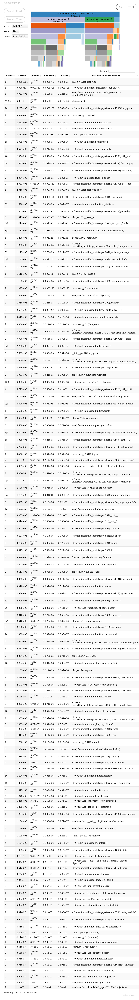

# Les Performances en Python

par

Julien Palard <julien@palard.fr>

https://mdk.fr


# Bien choisir sa structure de donnée

C'est bien choisir l'algorihtme qu'on va utiliser.


## Comparaison asymptotique

Les notations les plus utiisées :

```text
O(1)        Constant
O(log(n))   Logarithmique
O(n)        Linéaire
O(n log(n)) Parfois appelée « linéarithmique »
O(n²)       Quadratique
O(nᶜ)       Polynomiale
O(cⁿ)       Exponentielle
O(n!)       Factorielle
```

## Les mesures de complexité

- De temps (CPU consommé)
- D'espace (Mémoire consommée)
- Dans le meilleur des cas
- Dans le pire des cas
- Dans le cas moyen
- Amorti
- ...


## Les mesures de complexité

Il n'est pas forcément nécessaire d'apprendre par cœur toutes les complexités de chaque opération.

Pas toute suite.


## Les bases

Mais retenir par cœur la complexité de quelques structures
élémentaires permet d'éviter les « erreurs de débutants ».


## Rappel des unités de temps

- 1 milliseconde (1 ms) c'est un millième de seconde.
- 1 microseconde (1 μs) c'est un millionième de seconde.
- 1 nanoseconde (1 ns) c'est un milliardième de seconde.


## Le cas typique

```bash
$ python -m timeit -s 'container = list(range(10_000_000))' \
  '10_000_001 in container'
#!cache -- python -m timeit -s 'container = list(range(10_000_000))' '10_000_001 in container'

$ python -m timeit -s 'container = set(range(10_000_000))' \
  '10_000_001 in container'
#!cache -- python -m timeit -n 100 -s 'container = set(range(10_000_000))' '10_000_001 in container'
```

Pourquoi une si grande différence !?


::: notes

C'est l'heure du live coding !


# Les outils

## Les outils en ligne de commande

`time`, un outil POSIX, mais aussi une fonction native de bash :

```bash
$ time python -c 'container = set(range(10_000_000))'
#!cache -- time -p python -c 'container = set(range(10_000_000))' 2>&1
```

Mais `time` ne teste qu'une fois.

::: notes

real    0m0.719s  # C'est le temps « sur le mur »
user    0m0.521s  # Temps CPU passé « dans Python »
sys     0m0.195s  # Temps CPU passé dans le kernel


## Hyperfine

`hyperfine` teste plusieurs fois :

```text
$ hyperfine "python -c 'container = set(range(10_000_000))'"
Benchmark 1: python -c 'container = set(range(10_000_000))'
  Time (mean ± σ):     735.6 ms ±  11.2 ms
```


## Petite parenthèse

Mais attention, démarrer un processus Python n'est pas gratuit :

```python
$ hyperfine "python -c pass"
Benchmark 1: python -c pass
  Time (mean ± σ):      19.4 ms ±   0.6 ms
```

## Petite parenthèse

Et puis il peut dépendre de la version de Python, des options de compilation, ... :

```text
$ hyperfine "~/.local/bin/python3.10 -c pass"  # Avec pydebug
Benchmark 1: ~/.local/bin/python3.10 -c pass
  Time (mean ± σ):      37.6 ms ±   0.6 ms

$ hyperfine "/usr/bin/python3.10 -c pass"  # Sans pydebug
Benchmark 1: /usr/bin/python3.10 -c pass
  Time (mean ± σ):      19.1 ms ±   0.8 ms
```

::: notes

Leur parler de `--enable-optimizations` (PGO).


## timeit

Timeit c'est dans la stdlib de Python, ça s'utilise en ligne de commande ou depuis Python.


## pyperf

C'est l'équivalent d'hyperfine mais exécutant du Python plutôt qu'un programme :

```bash
$ ~/.local/bin/python3.10 -m pyperf timeit pass
.....................
Mean +- std dev: 7.33 ns +- 0.18 ns

$ /usr/bin/python3.10 -m pyperf timeit pass
.....................
Mean +- std dev: 6.10 ns +- 0.11 ns
```

::: notes

Avec hyperfine on teste combien de temps ça prend à Python **de
démarrer** puis d'exécuter `pass`, ici on teste combien de temps ça
prend d'exécuter `pass`.


## cProfile

time, timeit, hyperfine, pyperf c'est bien pour mesurer, comparer.

cProfile nous aider à trouver la fonction coupable dans un script plus gros.


## cProfile, exemple

```python
#!sed -n '/def fib/,/return approx/p' phi1.py
```


## cProfile, exemple

Testons :

```python
#!sed -n '/import sys/,$p' phi1.py
```

```text
$ time python phi1.py 10
#!cache -- time -p python phi1.py 10
```


C'est déjà lent, et pour `20` c'est interminable...


## cProfile, exemple

Sortons cProfile :

```text
$ python -m cProfile --sort cumulative phi1.py 10
#!cache -- python -m cProfile --sort cumulative phi1.py 10 | head -n 2 | sed 's/^ *//g;s/seconds/s/g'
...
```

C'est donc `fib` la coupable :
- C'est ~100% du temps (`cumtime`).
- C'est ~100% des appels de fonctions.


## cProfile, exemple

Cachons les résultats de `fib` :
```python
#!sed -n '/import cache/,/return fib/p' phi2.py
```

## cProfile, exemple

Et on repasse dans cProfile !

```text
$ python -m cProfile --sort cumulative phi2.py 10
#!cache -- python -m cProfile --sort cumulative phi2.py 10 | head -n 2 | sed 's/^ *//g;s/seconds/s/g'
```

C'est mieux !

## cProfile, exemple

On essaye d'aller plus loin ?

```text
$ python -m cProfile --sort cumulative phi2.py 1000
#!cache -- python -m cProfile --sort cumulative phi2.py 1000 | head -n 2 | sed 's/^ *//g;s/seconds/s/g'
```

Ça tient, mais peut-on faire mieux ?


## cProfile, exemple

Divisons par 10 le nombre d'appels, on réduira mécaniquement par 10 le
temps d'exécution ?

```python
#!sed -n '/def approx_phi_up_to/,/return step1/p' phi3.py
```

## cProfile, exemple

```text
$ python -m cProfile --sort cumulative phi3.py 1000
#!cache -- python -m cProfile --sort cumulative phi3.py 1000 | head -n 2 | sed 's/^ *//g;s/seconds/s/g'
```

## cProfile, exemple

En cachant `approx_phi` ?

```python
#!sed -n '10,/return step1/p' phi4.py
```

::: notes

Notez l'astuce pour que le `step2` d'un
tour soit le `step1` du suivant...

## cProfile, exemple

`RecursionError` !? En effet, en avançant par si grands pas, le cache
de `fib` n'est pas chaud, et il peut vite devoir descendre
profondément en récursion...

## cProfile, exemple

Il est temps de sortir une implémentation de `fib` plus robuste, basée
sur l'algorithme « matrix exponentiation » :

```python
#!sed -n '/def fib/,/return fib/p' phi5.py
```


## cProfile, exemple

```text
$ python -m cProfile --sort cumulative phi5.py 1000
#!cache -- python -m cProfile --sort cumulative phi5.py 1000 | head -n 2 | sed 's/^ *//g;s/seconds/s/g'
```

::: notes

Mieux.

## Snakeviz

```text
python -m pip install snakeviz
#!python -m pip install snakeviz >/dev/null 2>&1
python -m cProfile -o phi5.prof phi5.py 1000
#!if [ ! -f phi5.prof ]; then python -m cProfile -o /tmp/phi5.prof phi5.py 1000 >/dev/null 2>&1; fi
python -m snakeviz phi5.prof
#!if [ ! -f phi5.png ]; then python -m snakeviz -s phi5.prof & sleep 1; cutycapt --min-width=1024 --delay=500 --url=http://127.0.0.1:8080/snakeviz/%2Ftmp%2Fphi5.prof --out=phi5.png ; kill %1; fi
```

## Snakeviz



## TODO
snakeviz
scalene
vprof
https://pypi.org/project/pyflame/
...

# Cython

# Numba

# mypyc

# Pythran

# Hand crafted C
